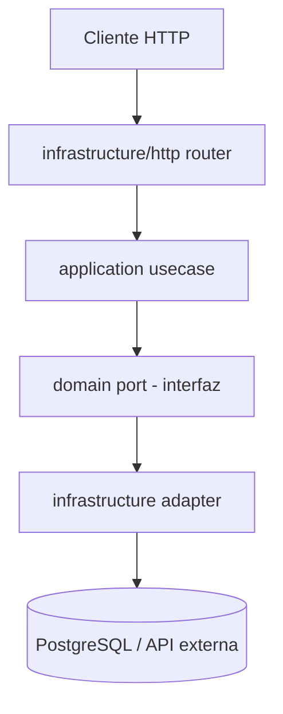

# Arquitectura del proyecto — guía para los 4

Este documento explica cómo está organizado el código y **por qué**, asumiendo que nunca usaste "arquitectura hexagonal" antes. Léelo antes de escribir tu primera línea de código en tu módulo.

---

## 1. La idea central, en una frase

> Las reglas del negocio (qué es una venta, qué es un usuario, cuándo se puede aprobar un ingreso de mercadería) **no deberían saber que existen FastAPI, PostgreSQL, Google Drive o Telegram.** Esas son solo herramientas que usamos hoy y que podríamos cambiar mañana.

Si mezclamos las reglas del negocio con el framework web y la base de datos, cambiar cualquier herramienta (por ejemplo, migrar de PostgreSQL a otra base de datos, o cambiar de bcrypt a otra librería de hashing) obliga a tocar el código que define "qué es un usuario" o "qué es una venta". Eso es frágil y, con 4 personas tocando el mismo repo, es una receta para pisarse el código constantemente.

La arquitectura hexagonal (también llamada "puertos y adaptadores") separa el código en capas para que eso no pase.

---

## 2. Las 3 capas, explicadas con una analogía

Imagina que el sistema es un **restaurante**:

- **`domain/` (el dominio)** es la **receta**. La receta dice "se cocina la carne a fuego medio 8 minutos", sin importar si la cocina es de gas o de inducción, ni qué marca de sartén se usa. Es el conocimiento puro del negocio: qué es un `Usuario`, qué es una `Venta`, qué reglas tiene un `IngresoMercaderia` para ser aprobado. **No importa nada de FastAPI, SQLAlchemy ni ninguna librería externa.** Es Python "a secas".

- **`application/` (la aplicación, los casos de uso)** es el **chef**: sigue la receta y coordina el proceso ("primero saca la carne del refrigerador, luego enciende la sartén, luego cocina"). Es el que orquesta *qué pasos* se siguen para lograr algo (`LoginUseCase`, `RegistrarVentaUseCase`, `AprobarIngresoUseCase`), pero **no sabe exactamente cómo se enciende esa sartén específica** — solo sabe que existe algo capaz de encenderla.

- **`infrastructure/` (la infraestructura)** es la **cocina real, con sus aparatos concretos**: la sartén de tal marca, el refrigerador de tal modelo, el proveedor de gas. Aquí sí vive el código que habla con FastAPI (los `routers`), con SQLAlchemy (las tablas y consultas reales), con bcrypt, con la API de Google Drive, con Telegram, etc.

### ¿Y qué es un "puerto" y un "adaptador"?

Sigamos con la cocina: el chef (la aplicación) necesita "algo que caliente la comida". No le importa si es una sartén eléctrica o una de gas — solo necesita que ese "algo" tenga un enchufe compatible con lo que él espera.

- El **puerto** es el **enchufe estándar**: una interfaz que dice "necesito algo que tenga estos métodos" (por ejemplo, `UsuarioRepositoryPort` dice "necesito algo que sepa `guardar(usuario)` y `buscar_por_id(id)`"). El puerto vive en `domain/ports/` y **no implementa nada**, solo define el contrato.
- El **adaptador** es **el aparato concreto que se conecta a ese enchufe**: `SQLAlchemyUsuarioRepository` es un adaptador que implementa `UsuarioRepositoryPort` usando PostgreSQL de verdad. Si mañana cambiamos de base de datos, escribimos *otro* adaptador (por ejemplo `MongoUsuarioRepository`) que respeta el mismo enchufe (el mismo puerto), y el chef (los casos de uso) **ni se entera del cambio**.

Esto es exactamente como los enchufes de electricidad: en distintos países hay distintas clavijas físicas, pero si tienes el adaptador correcto, el mismo aparato (la lógica de negocio) funciona sin cambiar nada de él.

### Resumen de las 3 capas

| Capa | Pregunta que responde | Depende de | Ejemplo en el proyecto |
|---|---|---|---|
| `domain/` | ¿Qué es esto y qué reglas tiene? | Nada externo, Python puro | `entities.py`, `value_objects.py`, `ports/*.py` |
| `application/` | ¿Qué pasos se siguen para lograr un objetivo? | Solo del `domain` (entidades y puertos) | `login_usecase.py`, `registrar_venta_usecase.py` |
| `infrastructure/` | ¿Cómo se conecta esto con el mundo real? | De `domain` + librerías externas (FastAPI, SQLAlchemy, etc.) | `sqlalchemy_usuario_repository.py`, `auth_router.py` |

**Regla de oro (la dirección de las flechas):** `infrastructure` → depende de → `application` → depende de → `domain`. Nunca al revés. El dominio no sabe que la infraestructura existe.

---

## 3. Cada módulo es una "rebanada vertical" completa

En vez de tener una sola carpeta `domain/` gigante para todo el sistema, **cada módulo (A, B, C, D) tiene su propio `domain/`, `application/` e `infrastructure/` completos**, como si fuera "su propia mini-aplicación hexagonal" dentro del proyecto grande:

```
modules/
 ┣ modulo_a_seguridad/     ← Matías: su propio domain + application + infrastructure
 ┣ modulo_b_inventario/    ← Brayan: su propio domain + application + infrastructure
 ┣ modulo_c_ventas/        ← Clever: su propio domain + application + infrastructure
 ┗ modulo_d_documentos/    ← Fabrizio: su propio domain + application + infrastructure
```

¿Por qué "rebanada vertical" y no "una capa gigante compartida"? Porque así **cada programador puede trabajar casi sin tocar archivos de los demás**: Brayan puede crear, modificar o incluso reescribir por completo el `domain` de inventario sin que eso obligue a Clever a tocar nada de ventas. Si en cambio tuviéramos un solo `domain/` compartido para todo el sistema, los 4 estaríamos constantemente editando los mismos archivos y generando conflictos de Git todo el tiempo.

Lo único que **de verdad** es compartido vive en `app/shared/`: configuración global (`config/settings.py`), la conexión a la base de datos (`database/session.py`), manejo de errores HTTP genérico (`http/error_handlers.py`) y excepciones base (`kernel/exceptions.py`). Ninguna regla de negocio de ningún módulo vive ahí.

---

## 4. La regla más importante: ningún módulo importa código interno de otro módulo

**Prohibido:** que `modulo_d_documentos` haga `from app.modules.modulo_a_seguridad.application.login_usecase import ...`. Eso vuelve a acoplar todo y perdemos la ventaja de trabajar en paralelo (si Matías cambia algo interno de su módulo, rompería el código de Fabrizio sin que él lo sepa).

Si un módulo necesita algo de otro módulo (por ejemplo, Ventas necesita saber si hay stock suficiente en Inventario, o Documentos necesita el nombre del negocio que vive en Configuración), hay **dos formas válidas** de resolverlo:

### Opción 1 — Puerto explícito "hacia afuera del módulo"

El módulo que necesita el dato define su propio puerto (en su propio `domain/ports/`) describiendo *lo que necesita*, no *de dónde lo saca*. Por ejemplo, `modulo_c_ventas/domain/ports/producto_stock_port.py` define `ProductoStockPort` con un método `obtener_stock(producto_id)`. Luego, en `infrastructure/`, se escribe un adaptador que sabe cómo obtener ese dato en la práctica.

### Opción 2 — Llamada HTTP interna entre módulos

El adaptador que implementa ese puerto, en vez de importar código Python de otro módulo, le hace una petición HTTP normal a los endpoints que ese módulo ya expone (los mismos `routers` que usa el frontend, o endpoints internos equivalentes). Es decir: los módulos se hablan entre sí **de la misma forma en que el frontend les habla a ellos**.

```
modulo_c_ventas/infrastructure/adapters/integrations/inventario_http_adapter.py
  → implementa ProductoStockPort
  → por dentro, hace un GET a /inventario/productos/{id}/stock (expuesto por modulo_b_inventario)
```

### ¿Cuál recomendamos?

**Recomendamos la Opción 2 (llamada HTTP interna) como estándar del proyecto**, por estas razones:

- Es la que **mejor respeta el aislamiento real entre módulos**: ni siquiera en tiempo de compilación/import hay una dependencia directa entre el código de un módulo y otro. Cada módulo podría, en teoría, desplegarse como un servicio separado sin cambiar nada de su código interno.
- Evita el riesgo de que "puerto explícito implementado con import directo" se convierta, con la presión del día a día, en un atajo para importar entidades o servicios internos de otro módulo (rompiendo la regla de esta sección sin darnos cuenta).
- Ya tenemos FastAPI corriendo con `routers` por módulo — no es trabajo extra exponer un endpoint interno adicional si hace falta.

El puerto (Opción 1) **siempre se define igual, sin importar cuál sea el mecanismo de la Opción 2 por dentro** — eso es justamente lo valioso de esta separación: el caso de uso de Ventas solo conoce `ProductoStockPort.obtener_stock(...)`, nunca se entera de que por debajo hay una llamada HTTP a otro módulo. Si en el futuro se decide usar Opción 1 con import directo para algo muy puntual y de bajísimo riesgo, debe ser una decisión explícita y conversada entre los 4, no un atajo silencioso.

---

## 5. Diagrama del flujo de una petición

```
Cliente (frontend / Postman)
        │  HTTP request
        ▼
┌─────────────────────────────┐
│ infrastructure/http/*router │  Traduce HTTP ⇄ Python. Cero lógica de negocio.
└──────────────┬──────────────┘
               │ llama a
               ▼
┌─────────────────────────────┐
│   application/*_usecase     │  Orquesta el "cómo se hace" usando el dominio.
└──────────────┬──────────────┘
               │ usa (a través de una interfaz)
               ▼
┌─────────────────────────────┐
│      domain/ports/*         │  El "enchufe": solo define el contrato.
└──────────────┬──────────────┘
               │ implementado por
               ▼
┌─────────────────────────────┐
│ infrastructure/adapters/*   │  El "aparato real": SQLAlchemy, bcrypt, Drive, etc.
└──────────────┬──────────────┘
               │
               ▼
        PostgreSQL / APIs externas
```

En Mermaid (por si tu editor lo renderiza):



`module_container.py` es quien "conecta los cables": crea la instancia real del adaptador y se la entrega al caso de uso. Los routers piden esas piezas ya armadas con `Depends(...)` de FastAPI — nunca instancian un adaptador a mano.

---

## 6. ¿Y el frontend?

El frontend **no usa arquitectura hexagonal** — React no tiene "reglas de negocio" en el mismo sentido (no hay nada equivalente a "un `Usuario` debe tener contraseña de al menos 8 caracteres" corriendo en el navegador de forma crítica). En cambio:

- El frontend se organiza **por módulo/feature** (`modules/modulo-a-seguridad/`, etc.), con `components/`, `pages/`, `hooks/`.
- Solo se toma **el concepto de puerto/adaptador** para la capa que habla con el backend: `services/algo.port.ts` define la interfaz ("necesito poder hacer `login()`, `logout()`"), y `services/algo.http-adapter.ts` la implementa con el cliente HTTP real (axios/fetch). Si el contrato del backend cambia, **solo se edita el adaptador**, nunca los componentes ni los hooks que ya lo usan.

Esto es el mismo enchufe-y-clavija de la sección 2, aplicado solo a "cómo le hablamos a la API", que es la única parte del frontend que realmente se beneficia de esa separación.

---

## 7. Resumen para cada uno de los 4

- **Trabajas casi siempre dentro de tu carpeta de módulo** (`backend/app/modules/modulo_x_.../` y `frontend/src/modules/modulo-x-.../`).
- Si necesitas algo de otro módulo, **no lo importes directamente**: define un puerto propio y llámalo por HTTP interno (sección 4).
- Solo tocas `app/shared/` (backend) o `src/shared/` (frontend) si es algo verdaderamente transversal (config, cliente HTTP base, manejo de errores genérico) — y en ese caso, avisa a los otros 3, porque ahí sí se puede pisar el trabajo de todos.
- `domain/` nunca importa nada de `infrastructure` ni de FastAPI/SQLAlchemy. Si tu IDE te sugiere importar `fastapi` dentro de `domain/`, es una señal de que algo está en la carpeta equivocada.
