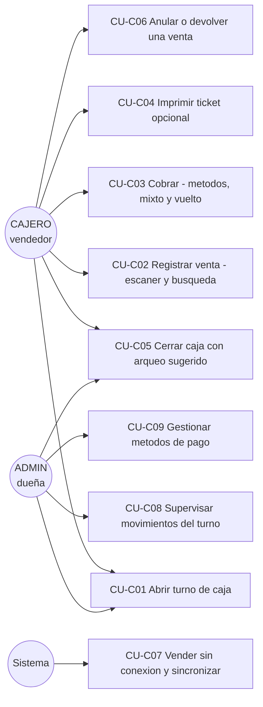

# Casos de Uso — Módulo C (Ventas, Caja y Punto de Venta) · Clever

Especificación de casos de uso (SOL-02-C) de las historias HU-C01 a HU-C10.

## Diagrama general

---

## CU-C01 — Abrir turno de caja (HU-C06, RF-25)

| | |
|---|---|
| **Actor** | CAJERO o ADMIN |
| **Precondiciones** | Sesión activa con permiso `caja.abrir_turno`; no hay otro turno abierto. |
| **Flujo principal** | 1. El cajero entra a Caja y cuenta el efectivo físico (sencillo para el vuelto). 2. Registra el monto inicial. 3. El sistema crea el turno con su nombre, fecha/hora y monto, y lo registra en bitácora (`caja_abierta`). 4. El turno queda visible para TODOS los usuarios en el historial: en un cambio de turno, el entrante ve con cuánto abrió y cerró el anterior. |
| **Flujos alternativos** | **A1 — Ya hay un turno abierto:** 409 "La caja ya está abierta por X" (además la BD lo impide con un índice parcial único). **A2 — Vender sin turno:** el POS rechaza la venta (409) hasta que se abra la caja. |
| **Postcondiciones** | Turno ABIERTO con responsable único; el POS queda habilitado. |

## CU-C02 — Registrar venta con escáner y búsqueda (HU-C01, HU-C02, HU-C03, RF-07)

| | |
|---|---|
| **Actor** | CAJERO |
| **Precondiciones** | Turno abierto; productos registrados con stock (Módulo B). |
| **Flujo principal** | 1. El cajero escanea el producto (el lector emula un teclado y termina con Enter): entra al carrito con cantidad 1, nombre y precio. 2. Escanear de nuevo suma 1; o escribe la cantidad directo en el ítem (ej. 5 botellas). 3. Para productos sin código de barras, escribe el nombre o código interno y un desplegable autocompleta (máx. 8 sugerencias, flechas + Enter o clic). 4. El sistema calcula subtotales y total. 5. Pasa a cobrar (CU-C03). |
| **Flujos alternativos** | **A1 — Código no registrado:** aviso "No hay ningún producto con el código…". **A2 — Sin stock:** el producto no aparece en el POS y el backend rechaza igual (el stock nunca queda negativo; descuento atómico). **A3 — Dos cajas compiten por las últimas unidades:** solo una gana; la otra recibe 409 con el stock real. |
| **Postcondiciones** | Venta COMPLETADA asociada a usuario, turno, fecha/hora; stock descontado en la misma transacción (RNF-03); `venta_registrada` en bitácora. |

## CU-C03 — Cobrar: métodos de pago, pago mixto y vuelto (HU-C04, RF-20)

| | |
|---|---|
| **Actor** | CAJERO |
| **Precondiciones** | Carrito con productos; catálogo de métodos activo (EFECTIVO, YAPE, PLIN, TARJETA, TRANSFERENCIA…). |
| **Flujo principal** | 1. Elige el método en botones grandes. 2. Si es efectivo, opcionalmente indica con cuánto paga el cliente y el sistema calcula el vuelto. 3. Para pago mixto divide el total entre métodos; la suma debe cuadrar EXACTO. 4. Confirma: la venta guarda cada pago por separado (para el arqueo y la conciliación de billeteras). |
| **Flujos alternativos** | **A1 — Sin método de pago:** 422, ninguna venta se confirma sin método. **A2 — Mixto descuadrado:** 422 con el detalle de cuánto falta/sobra. **A3 — Efectivo recibido insuficiente:** el botón de confirmar se bloquea. |
| **Postcondiciones** | `pagos_venta` registrados con snapshot de método y bandera es_efectivo; el vuelto queda en el ticket. |

## CU-C04 — Imprimir ticket opcional (HU-C05, RF-11)

| | |
|---|---|
| **Actor** | CAJERO |
| **Precondiciones** | Venta recién confirmada (ya cerrada); impresora térmica instalada en el equipo (58 u 80 mm). |
| **Flujo principal** | 1. Tras cobrar, el modal muestra el vuelto en grande y el botón "Imprimir ticket". 2. SOLO si el cliente lo pide, se imprime: HTML con ancho térmico vía el diálogo del sistema (compatible con cualquier térmica ESC/POS con driver, sin atarse a una marca). 3. "Nueva venta" continúa sin imprimir. |
| **Flujos alternativos** | **A1 — Cliente lo pide después:** reimpresión desde el Historial de ventas. **A2 — Sin impresora:** la venta ya está registrada, nada se bloquea. |
| **Postcondiciones** | Ninguna en BD: imprimir no es requisito de la venta. |

## CU-C05 — Cerrar caja con arqueo sugerido (HU-C07, RF-17)

| | |
|---|---|
| **Actor** | CAJERO o ADMIN |
| **Precondiciones** | Turno abierto (permiso `caja.cerrar_turno`). |
| **Flujo principal** | 1. El sistema calcula y SUGIERE el efectivo esperado: inicial + ventas en efectivo − devoluciones en efectivo. 2. Muestra aparte lo cobrado por medios digitales ("existe pero NO está en el cajón") y el total vendido del turno. 3. El cajero cuenta el dinero físico; el campo viene prellenado con la sugerencia. 4. Si coincide, cierra directo: la sugerencia no se puede descuadrar. 5. El cierre guarda el arqueo (esperado, contado, diferencia, desglose) y `caja_cerrada` en bitácora. |
| **Flujos alternativos** | **A1 — Monto distinto a la sugerencia:** el comentario es OBLIGATORIO (422 sin él); se registra además `caja_descuadre` y la administradora ve diferencia y comentario en el historial de turnos. **A2 — Cierra otro cajero (cambio de turno):** válido; queda `cerrado_por` con su nombre. |
| **Postcondiciones** | Turno CERRADO con arqueo único e inmutable; historial visible para todos. |

## CU-C06 — Anular o devolver una venta (HU-C08, RF-22)

| | |
|---|---|
| **Actor** | CAJERO (permisos `ventas.anular` / `ventas.devolver`; el ADMIN puede revocarlos sin redeploy) |
| **Precondiciones** | Venta registrada no anulada; turno abierto (el dinero devuelto sale de ESA caja). |
| **Flujo principal** | 1. Desde el Historial elige Anular (total) o Devolver (parcial, por líneas y cantidades). 2. Indica el motivo (obligatorio). 3. El sistema repone el stock, calcula cuánto efectivo sale del cajón (nunca más de lo que la venta pagó en efectivo) y crea el REVERSO con quién/cuándo/motivo/items. 4. La venta original NUNCA se borra: cambia a ANULADA o DEVUELTA_PARCIAL. |
| **Flujos alternativos** | **A1 — Ya anulada:** 409. **A2 — Devolver más de lo vendido:** 422 con lo que queda por devolver. **A3 — Cambio de producto:** devolución + nueva venta; ambas dejan rastro. |
| **Postcondiciones** | El rastro queda en `anulaciones`, en bitácora (`venta_anulada`/`venta_devuelta`) y en el modal de movimientos del panel de caja de la administradora; el arqueo del turno descuenta el efectivo devuelto. |

## CU-C07 — Vender sin conexión y sincronizar (HU-C10, RF-26)

| | |
|---|---|
| **Actor** | CAJERO / Sistema (sincronización automática) |
| **Precondiciones** | El POS operó al menos una vez con conexión (catálogo y turno cacheados). |
| **Flujo principal** | 1. El sistema detecta la caída (ping a /health) y muestra "Sin conexión — modo local". 2. El POS sigue vendiendo con el catálogo cacheado; cada venta se guarda en el navegador con un UUID único y descuenta el stock del caché. 3. El ticket se imprime igual (marcado "pendiente de sincronizar"). 4. Al volver la conexión, las ventas se envían solas; el UUID único hace la sincronización IDEMPOTENTE: reintentar jamás duplica. 5. El servidor guarda la hora REAL de la venta (`vendida_en`). |
| **Flujos alternativos** | **A1 — El servidor rechaza una venta al sincronizar (ej. otro cajero agotó el stock):** queda marcada con su motivo para revisarla con la administradora; nunca se descarta en silencio. |
| **Postcondiciones** | Ninguna venta se pierde; las sincronizadas quedan con `registrada_offline = true`. |

## CU-C08 — Supervisar movimientos del turno (HU-C06/C07/C08, RNF-12)

| | |
|---|---|
| **Actor** | ADMIN |
| **Precondiciones** | Rol ADMIN. |
| **Flujo principal** | 1. En su panel de Caja ve el historial completo de turnos: quién abrió y con cuánto, quién cerró, diferencia del arqueo y comentario. 2. Con "Ver" abre el modal de RASTRO del turno: todas las ventas y las anulaciones/devoluciones (con motivo y efectivo devuelto). 3. Los descuadres se filtran también en la Bitácora (`caja_descuadre`). |
| **Flujos alternativos** | **A1 — Cajero:** ve el historial de turnos (aperturas/cierres) pero el modal de movimientos es del panel del ADMIN. |
| **Postcondiciones** | Ninguna (solo lectura). |

## CU-C09 — Gestionar métodos de pago (RF-20)

| | |
|---|---|
| **Actor** | ADMIN (permiso `metodos_pago.gestionar`) |
| **Precondiciones** | Sesión de ADMIN. |
| **Flujo principal** | 1. Consulta el catálogo (`GET /metodos-pago?todos=true`). 2. Agrega un método nuevo (ej. una nueva billetera) indicando si es dinero físico (`es_efectivo`). 3. Desactiva los que ya no se usen. 4. Los cambios aplican al instante en el POS, sin redeploy. |
| **Flujos alternativos** | **A1 — Desactivar EFECTIVO:** 422, está protegido (la caja depende de él). **A2 — Código duplicado:** 409. |
| **Postcondiciones** | Catálogo actualizado; el historial no cambia (los pagos guardan snapshot del método). |
