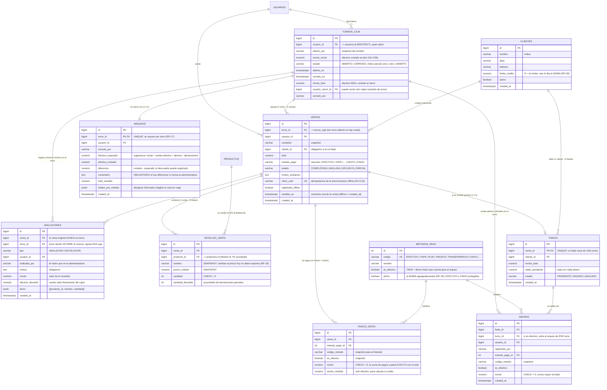

# Diagrama Entidad-Relación — Módulo C (Ventas, Caja y Punto de Venta) · Clever

Tablas del Módulo C en PostgreSQL (SOL-01-C). Todas las fechas son `TIMESTAMPTZ` y todos los
montos `NUMERIC(10,2)`. Nada se borra físicamente: las ventas se ANULAN con un reverso que
deja rastro, y los FK usan `ON DELETE RESTRICT` para que nadie con historial pueda desaparecer.
El script DDL de estas tablas es `backend/db/schema_modulo_c.sql` (SOL-03-C).

## Decisiones de diseño

- **Índice parcial único `ux_turnos_caja_abierto`** (`WHERE estado = 'ABIERTO'`): la tienda tiene
  una sola caja física, así que la BD misma impide dos turnos abiertos a la vez.
- **Snapshots en `detalles_venta` y `pagos_venta`** (`nombre`, `precio_unitario`, `codigo_metodo`,
  `es_efectivo`): los reportes históricos no se alteran cuando el ADMIN cambia precios o renombra
  métodos de pago (RF-18).
- **Modelo entrada/salida de efectivo por turno (RF-17)**: el dinero *entra* con las ventas y
  abonos del turno y *sale* con los reversos hechos durante el turno (`anulaciones.turno_id` es el
  turno del reverso, no el de la venta). Así el arqueo cuadra aunque se anule hoy una venta de ayer.
- **`es_efectivo` en el catálogo de métodos**: separa el dinero físico del digital; el arqueo solo
  cuadra contra efectivo y lo digital se muestra aparte ("existe pero no está en el cajón").
- **La venta nunca se borra (RF-22)**: `estado` + tabla `anulaciones` como rastro inmutable de
  reversos con quién/cuándo/motivo/efectivo devuelto.
- **`fiados.venta_id UNIQUE` (RF-28)**: la deuda nace de una venta concreta; el fiado no ingresa
  dinero (no genera `pagos_venta` en efectivo) y los abonos sí lo hacen, en su propio turno.
- **`ventas.client_uuid UNIQUE` (RF-26)**: idempotencia de la sincronización offline — si el POS
  reintenta enviar la misma venta local dos veces, la segunda no duplica.
- **FK cruzada acordada con el Módulo B** (`detalles_venta.producto_id -> productos.id`): única
  dependencia física entre módulos, acordada según `ARQUITECTURA.md` §4; el código accede al stock
  solo a través del puerto `ProductoStockPort`.
