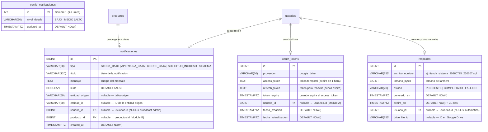

# Diagrama Entidad-Relación — Módulo D (Documentos)

**Módulo**: Notas de Venta, Reportes, Notificaciones, Respaldos e Infraestructura
**Base de datos**: PostgreSQL 16
**Zona horaria**: America/Lima

---

## Diagrama Mermaid

---

## Tablas resumen

| Tabla | PK | FK | Descripcion |
|-------|----|----|-------------|
| `notificaciones` | `id` (BIGINT) | `usuario_id` → `usuarios.id`, `producto_id` → `productos.id` | Notificaciones del sistema (stock bajo, caja, solicitudes, etc.) |
| `config_notificaciones` | `id` (INT, siempre 1) | — | Configuracion global de notificaciones |
| `respaldos` | `id` (BIGINT) | `usuario_id` → `usuarios.id` | Registro de copias de seguridad (Google Drive) |
| `oauth_tokens` | `id` (BIGINT) | `usuario_id` → `usuarios.id` | Tokens OAuth para Google Drive |

---

## Cardinalidades

| Relacion | Tipo | Descripcion |
|----------|------|-------------|
| `usuarios` → `notificaciones` | 1:0..N | Un usuario puede recibir muchas notificaciones (NULL = broadcast admin) |
| `usuarios` → `oauth_tokens` | 1:0..1 | Un usuario autoriza Google Drive (un solo token por proveedor) |
| `usuarios` → `respaldos` | 1:0..N | Un usuario puede crear muchos respaldos manuales |
| `productos` → `notificaciones` | 1:0..N | Un producto puede generar alertas de stock bajo |

---

## Notas

- Las 4 tablas son del **modulo D**. Las tablas referenciadas (`usuarios`, `productos`) pertenecen a otros modulos.
- `config_notificaciones` es **fila unica** (id=1), similar a `configuracion_negocio` de Module A.
- `notificaciones` no tiene borrado logico; se purgan despues de 30 dias (RNF-14).
- `respaldos` almacena archivos `.sql` en Google Drive (carpeta `respaldos/YYYY/MM/`). Retencion: 21 dias. `usuario_id` es NULL para respaldos automaticos (cada domingo).
- `oauth_tokens` almacena tokens OAuth para Google Drive. Un solo registro por proveedor (google_drive). El `refresh_token` nunca expira; el `access_token` se renueva automaticamente.
- Las tablas `boletas_clientes` y `archivos_drive` fueron eliminadas en migraciones anteriores.
