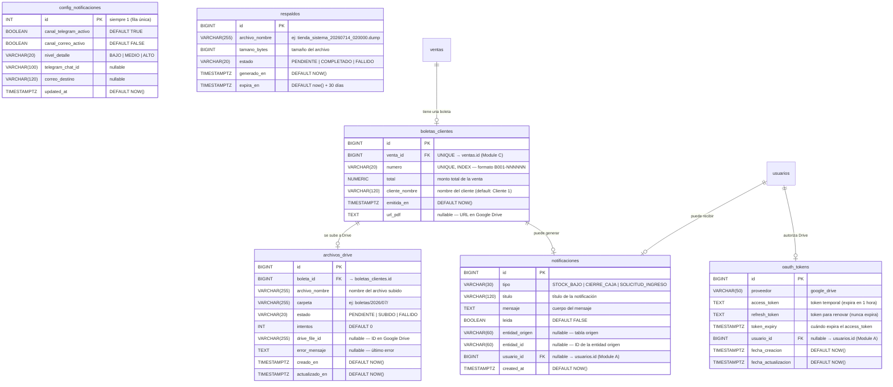

# Diagrama Entidad-Relación — Módulo D (Documentos)

**Módulo**: Documentos (Boletas/Drive), Reportes, Notificaciones e Infraestructura
**Base de datos**: PostgreSQL 16
**Zona horaria**: America/Lima

---

## Diagrama Mermaid

---

## Tablas resumen

| Tabla | PK | FK | Descripción |
|-------|----|----|-------------|
| `boletas_clientes` | `id` (BIGINT) | `venta_id` → `ventas.id` (Module C) | Boletas digitales generadas |
| `archivos_drive` | `id` (BIGINT) | `boleta_id` → `boletas_clientes.id` | Control de subida a Google Drive |
| `notificaciones` | `id` (BIGINT) | `usuario_id` → `usuarios.id` (Module A) | Notificaciones del sistema |
| `config_notificaciones` | `id` (INT, siempre 1) | — | Configuración de canales |
| `respaldos` | `id` (BIGINT) | — | Registro de copias de seguridad |
| `oauth_tokens` | `id` (BIGINT) | `usuario_id` → `usuarios.id` (Module A) | Tokens OAuth para Google Drive |

---

## Cardinalidades

| Relación | Tipo | Descripción |
|----------|------|-------------|
| `ventas` → `boletas_clientes` | 1:0..1 | Una venta puede tener una boleta (o ninguna si aún no se genera) |
| `boletas_clientes` → `archivos_drive` | 1:0..1 | Una boleta se sube a Drive (o pendiente) |
| `boletas_clientes` → `notificaciones` | 1:0..N | Una boleta puede generar notificaciones |
| `usuarios` → `notificaciones` | 1:0..N | Un usuario puede recibir muchas notificaciones |
| `usuarios` → `oauth_tokens` | 1:0..1 | Un usuario autoriza Google Drive (un solo token por proveedor) |

---

## Notas

- Las 6 tablas son del **módulo D**. Las tablas referenciadas (`ventas`, `usuarios`) pertenecen a otros módulos.
- `config_notificaciones` es **fila única** (id=1), similar a `configuracion_negocio` de Module A.
- `boletas_clientes` tiene `venta_id UNIQUE` porque una venta solo genera una boleta.
- `boletas_clientes` incluye `cliente_nombre` (VARCHAR 120) para identificar al cliente. Default: "Cliente 1".
- `notificaciones` no tiene borrado lógico; se purgan después de 30 días (RNF-14).
- `respaldos` expiran después de 30 días; los scripts de limpieza los eliminan.
- `oauth_tokens` almacena tokens OAuth para Google Drive. Un solo registro por proveedor (google_drive). El `refresh_token` nunca expira; el `access_token` se renueva automáticamente.
