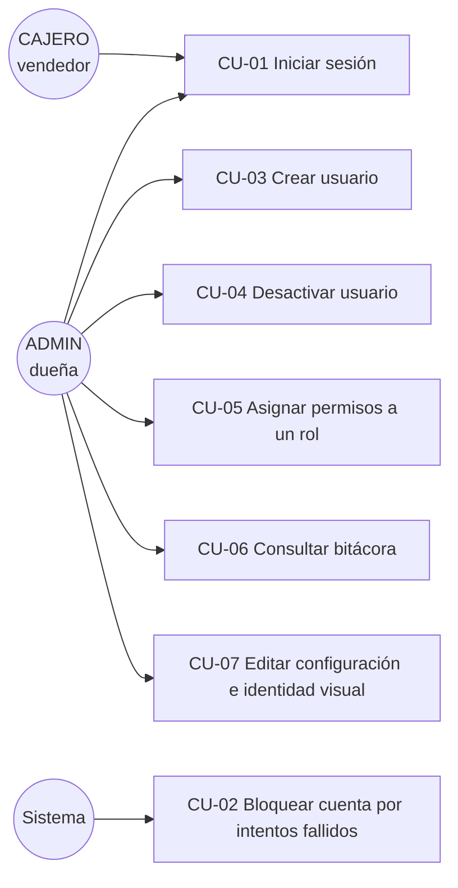

# Casos de Uso — Módulo A (Seguridad, Accesos, Configuración y Auditoría)

## Diagrama general

---

## CU-01 — Iniciar sesión

| | |
|---|---|
| **Actor** | ADMIN o CAJERO |
| **Precondiciones** | El usuario existe, está activo y no está bloqueado. |
| **Flujo principal** | 1. El actor ingresa alias y contraseña en la pantalla de login (que **no** tiene opción "Crear cuenta"). 2. El sistema verifica las credenciales (bcrypt). 3. Resetea contadores de intentos, registra `ultimo_acceso`. 4. Emite access token (JWT, 15 min) y refresh token (TTL según rol: 30 días ADMIN / 12 h CAJERO, configurable). 5. Registra `login_exitoso` en bitácora. 6. Redirige al inicio según rol. |
| **Flujos alternativos** | **A1 — Credenciales inválidas:** responde 401 con mensaje genérico "Usuario o contraseña incorrectos" (sin revelar cuál campo falló), incrementa `intentos_fallidos` y registra `login_fallido`. **A2 — Cuenta bloqueada:** responde 423 y registra `login_rechazado_bloqueo`. **A3 — Usuario inactivo/eliminado:** mismo 401 genérico del A1. **A4 — `debe_cambiar_password` activo:** el frontend fuerza el cambio de contraseña antes de continuar. |
| **Postcondiciones** | Sesión persistente creada en `sesiones`; evento en bitácora. |

## CU-02 — Bloquear cuenta por intentos fallidos

| | |
|---|---|
| **Actor** | Sistema (automático) |
| **Precondiciones** | Un usuario acumula `max_intentos_login` fallos consecutivos (3 por defecto, configurable). |
| **Flujo principal** | 1. Al fallar el intento N.º 3, el sistema fija `bloqueado_hasta = ahora + minutos_bloqueo` (15 min por defecto). 2. Resetea el contador. 3. Registra `cuenta_bloqueada` en la bitácora con el motivo. |
| **Flujos alternativos** | **A1 — Login durante el bloqueo:** responde 423 incluso con la contraseña correcta. **A2 — Bloqueo vencido:** el siguiente login válido entra normalmente y limpia `bloqueado_hasta`. **A3 — ADMIN resetea contraseña:** el reseteo limpia bloqueo y contadores. |
| **Postcondiciones** | La cuenta no puede iniciar sesión hasta que venza el bloqueo; el evento queda auditado (la dueña puede verlo). |

## CU-03 — Crear usuario

| | |
|---|---|
| **Actor** | ADMIN |
| **Precondiciones** | Sesión de ADMIN activa (permiso `usuarios.gestionar`). |
| **Flujo principal** | 1. El ADMIN abre Gestión de Usuarios → "+ Nuevo usuario". 2. Ingresa alias (ej. `vendedor2`), nombre para mostrar, contraseña inicial y rol. 3. El sistema valida formato de alias y política de contraseña (≥8, letra y número). 4. Crea el usuario con `debe_cambiar_password = true`. 5. Registra `usuario_creado` en bitácora con los valores nuevos. |
| **Flujos alternativos** | **A1 — Alias duplicado:** 409 "El usuario ya existe". **A2 — Contraseña débil:** 422 con el detalle de la política. **A3 — CAJERO llama la API directamente:** 403 (validado en servidor, no solo UI). |
| **Postcondiciones** | El nuevo usuario puede iniciar sesión y debe cambiar su contraseña en el primer ingreso. |

## CU-04 — Desactivar usuario

| | |
|---|---|
| **Actor** | ADMIN |
| **Precondiciones** | El usuario objetivo existe y no es el propio ADMIN que ejecuta la acción. |
| **Flujo principal** | 1. El ADMIN pulsa "Desactivar" sobre el usuario. 2. El sistema pone `activo = false` y **revoca todas sus sesiones** (se le cierra la app al instante). 3. Registra `usuario_desactivado` con el antes/después. |
| **Flujos alternativos** | **A1 — Reactivar:** operación inversa (`usuario_activado`). **A2 — Auto-desactivación:** 422 "No puedes desactivar tu propia cuenta". **A3 — Eliminar:** el borrado es LÓGICO (`deleted_at`/`deleted_by`); el historial de ventas y movimientos del usuario permanece trazable. |
| **Postcondiciones** | El usuario no puede iniciar sesión, pero su historial completo se conserva. |

## CU-05 — Asignar permisos a un rol

| | |
|---|---|
| **Actor** | ADMIN |
| **Precondiciones** | Sesión de ADMIN; los permisos existen en la tabla `permisos` (sembrados por seed). |
| **Flujo principal** | 1. El ADMIN consulta los permisos actuales del rol (`GET /roles/{id}/permisos`). 2. Envía la nueva lista completa (`PUT /roles/{id}/permisos`). 3. El sistema reemplaza las filas de `rol_permisos`. 4. Registra `permisos_modificados` con la lista anterior y la nueva. |
| **Flujos alternativos** | **A1 — Código de permiso inexistente:** 422 listando los códigos desconocidos, sin aplicar nada. |
| **Postcondiciones** | El cambio aplica de inmediato (los permisos se consultan en BD en cada request): sin redeploy y sin re-login. |

## CU-06 — Consultar bitácora

| | |
|---|---|
| **Actor** | ADMIN |
| **Precondiciones** | Sesión de ADMIN (permiso `bitacora.ver`). |
| **Flujo principal** | 1. La dueña abre Bitácora. 2. Filtra por rango de fechas, usuario, acción y/o entidad. 3. El sistema devuelve los eventos paginados, más recientes primero, con quién/qué/cuándo/antes/después/IP. **Objetivo: identificar quién realizó una operación en menos de 1 minuto.** |
| **Flujos alternativos** | **A1 — CAJERO intenta consultarla:** 403. **A2 — Intento de modificar/borrar un registro:** no existen endpoints para ello y la BD lo rechaza con excepción (trigger): la bitácora es inmutable para todos, incluido el ADMIN. |
| **Postcondiciones** | Ninguna (solo lectura). |

## CU-07 — Editar configuración e identidad visual

| | |
|---|---|
| **Actor** | ADMIN |
| **Precondiciones** | Sesión de ADMIN (permiso `configuracion.editar`). |
| **Flujo principal** | 1. El ADMIN abre Configuración. 2. Edita nombre comercial, logo (subida de archivo ≤ 500 KB), colores, tipografía y/o parámetros de seguridad (TTL de sesión por rol, intentos máximos, minutos de bloqueo). 3. El sistema guarda la fila única y registra `configuracion_actualizada` con antes/después. 4. El frontend aplica el tema al instante (variables CSS) y lo persiste. |
| **Flujos alternativos** | **A1 — Valores inválidos (TTL ≤ 0, etc.):** 422. **A2 — Logo muy grande o formato no soportado:** 422. **A3 — Lectura:** cualquier usuario autenticado (y los módulos B/C/D) puede leer la configuración vía `GET /configuracion` — el logo y nombre van en la boleta digital. |
| **Postcondiciones** | Nuevos logins usan los nuevos TTL/límites; el tema es visible para todos los usuarios. |
