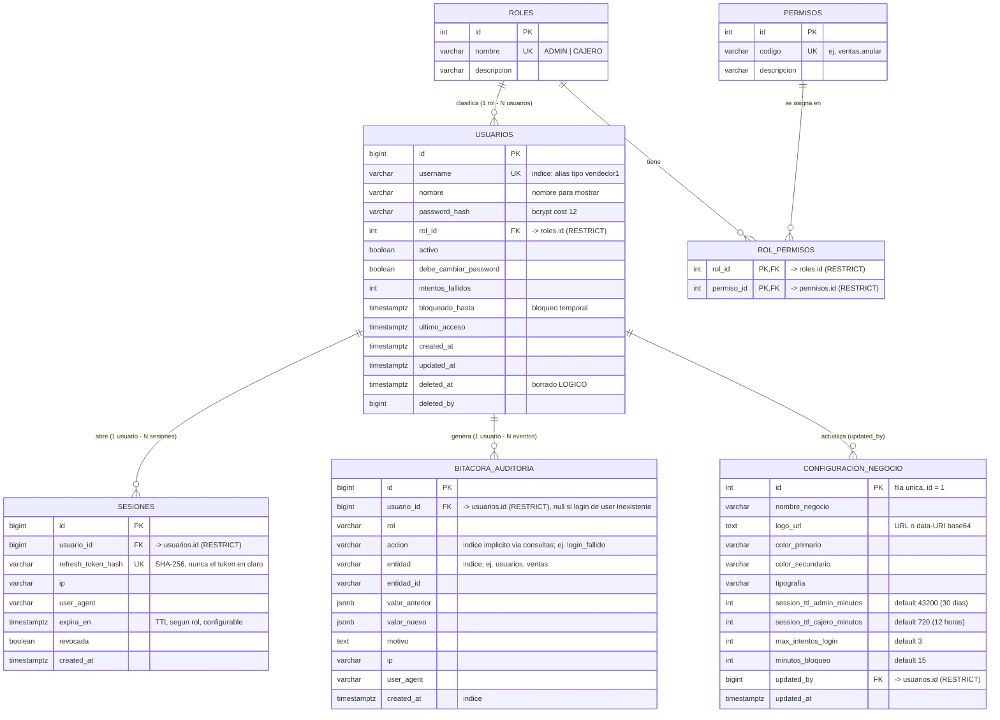

# Diagrama Entidad-Relación — Módulo A (Seguridad, Accesos, Configuración y Auditoría)

Tablas del Módulo A en PostgreSQL. Todas las fechas son `TIMESTAMPTZ`. Nada se borra físicamente:
`usuarios` usa borrado lógico (`deleted_at`/`deleted_by`) y `bitacora_auditoria` es inmutable (trigger + REVOKE).

## Decisiones de diseño

- **FK con `ON DELETE RESTRICT`** en todo lo que apunta a `usuarios`: un usuario con historial no puede desaparecer de la BD — garantiza la trazabilidad que pide la dueña.
- **`rol_permisos` en BD** (no permisos hardcodeados): el ADMIN puede ajustar permisos sin redeploy (`PUT /roles/{id}/permisos`).
- **`sesiones.refresh_token_hash`**: se guarda solo el SHA-256 del refresh token; si la BD se filtra, los tokens no sirven.
- **`bitacora_auditoria` inmutable**: trigger `trg_bitacora_inmutable` lanza excepción ante `UPDATE`/`DELETE`, y el usuario de aplicación además tiene revocados esos privilegios (defensa en dos capas).
- **JSONB para valor_anterior/valor_nuevo**: permite auditar el "antes y después" de cualquier entidad de cualquier módulo sin cambiar el schema.
