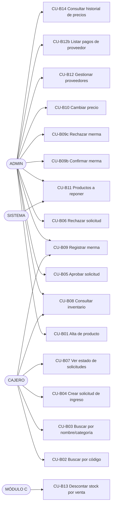

# Módulo B — Casos de Uso

> Especificación de **casos de uso** del Módulo B.
> Autor: Brayan. Mantenedor: equipo Módulo B.
> Versión: 1.0.

## 1. Alcance

Este documento describe los **14 casos de uso** que cubren las 14 historias de usuario del Módulo B, más un caso de uso adicional (`CU-B13`) que documenta el contrato del Módulo B con el Módulo C para el descuento de stock durante una venta (RNF-03, HU-B10).

Cada CU sigue la convención del proyecto (basada en `CAMBIOS-MATIAS/CASOS_DE_USO_MODULO_A.md`):

- Tabla de 2 columnas con filas `**Actor**`, `**Precondiciones**`, `**Flujo principal**`, `**Flujos alternativos**`, `**Postcondiciones**`.
- Flujo principal **numerado**.
- Trazabilidad a `HU-Bxx`, `RF-xx` y `RNF-xx` correspondiente.

## 2. Actores

| Actor | Descripción |
|---|---|
| **ADMIN** | La administradora del negocio. Tiene todos los permisos. Único rol que aprueba/rechaza ingresos, modifica precios, y confirma/rechaza mermas. También puede registrar mermas. |
| **CAJERO** | Usuario de caja. Crea solicitudes de ingreso, consulta inventario, ve el estado de sus solicitudes, **reporta mermas** (paso 1, sin tocar stock). No edita precios, no aprueba ingresos, no confirma mermas. |
| **SISTEMA** | Procesos automáticos: alertas de stock mínimo, validaciones de unicidad, consistencia transaccional. |
| **MÓDULO C** | Módulo de Ventas. Actúa como **cliente del Módulo B** para descontar stock durante una venta (CU-B13, RNF-03). |

## 3. Diagrama general

## 4. Índice de casos de uso

| CU | Nombre | HU | RF | RNF | Actor principal |
|---|---|---|---|---|---|
| CU-B01 | Alta de producto | HU-B01, HU-B03 | RF-03, RF-04 | — | ADMIN |
| CU-B02 | Buscar producto por código (escaneo) | HU-B02 | RF-03 | RNF-02 (rendimiento) | CAJERO, ADMIN |
| CU-B03 | Buscar producto por nombre o categoría | HU-B04 | RF-04 | RNF-02 | CAJERO |
| CU-B04 | Crear solicitud de ingreso de mercadería | HU-B05, HU-B06 | RF-05, RF-06 | — | CAJERO, ADMIN |
| CU-B05 | Aprobar solicitud de ingreso | HU-B07 | RF-06 | RNF-03 | ADMIN |
| CU-B06 | Rechazar solicitud de ingreso | HU-B07 | RF-06 | — | ADMIN |
| CU-B07 | Consultar estado de solicitudes | HU-B08 | RF-06 | — | CAJERO, ADMIN |
| CU-B08 | Consultar inventario en tiempo real | HU-B09 | RF-09 | RNF-12 (mobile) | CAJERO, ADMIN |
| CU-B09 | Registrar merma (paso 1, estado `Registrada`) | HU-B12 | RF-23 | — | ADMIN, CAJERO |
| CU-B09b | Confirmar merma (paso 2, descuenta stock) | HU-B12 | RF-23 | — | ADMIN |
| CU-B09c | Rechazar merma (paso 2, sin tocar stock) | HU-B12 | RF-23 | — | ADMIN |
| CU-B10 | Cambiar precio de producto | HU-B11 | RF-18 | — | ADMIN |
| CU-B11 | Listar productos a reponer (alerta stock mínimo) | HU-B13 | RF-24 | — | SISTEMA / ADMIN |
| CU-B12 | Gestionar proveedores y deuda | HU-B14 | RF-27 | — | ADMIN |
| CU-B12b | Listar pagos de un proveedor | HU-B14 | RF-27 | — | ADMIN |
| CU-B13 | Descontar stock por venta (contrato con Módulo C) | HU-B10 | RF-08 | RNF-03 (atomicidad) | MÓDULO C |
| CU-B14 | Consultar historial de precios | HU-B11 | RF-18 | — | ADMIN |

---

## CU-B01 — Alta de producto

| Campo | Detalle |
|---|---|
| **HU asociadas** | HU-B01 (alta con código de barras), HU-B03 (alta con código interno `PREFIJO-CORRELATIVO`). |
| **RF** | RF-03, RF-04. |
| **Actor** | ADMIN. |
| **Precondiciones** | El ADMIN está autenticado (JWT válido, rol `ADMIN`). La categoría seleccionada existe y no está borrada lógicamente. Para alta con código de barras: el código escaneado no existe en `productos`. Para alta con código interno: el prefijo (ej. `PAP`) está configurado y el correlativo no fue usado. |
| **Flujo principal** | 1. El ADMIN accede a la pantalla **Gestión de Productos → Nuevo Producto**. 2. Elige el tipo de código: **Código de barras** (escaneado con la lectora) o **Código interno** (generado automáticamente con el formato `PREFIJO-CORRELATIVO`). 3. Completa el formulario: `nombre`, `categoria_id`, `precio_venta`, `precio_compra_actual`, `stock_minimo`. 4. Adjunta la **foto del producto** (opcional, recomendado). 5. Pulsa **Guardar**. 6. El sistema valida que el `codigo` no exista (`UNIQUE` en BD). 7. El sistema valida que `categoria_id` exista. 8. El sistema hace `INSERT` en `productos` con `stock=0`, `activo=TRUE`, `es_codigo_interno` según corresponda, y los snapshots `creado_por`/`creado_por_nombre`. 9. El sistema hace `INSERT` en `historial_precios` con `precio_anterior=NULL`, `precio_nuevo=precio_venta`, `tipo_precio='venta'` (es el **alta**, no hay precio anterior). 10. La pantalla muestra el producto creado y limpia el formulario. |
| **Flujos alternativos** | **A) Código de barras duplicado** → la BD rechaza por `UNIQUE`; el sistema devuelve 409; se muestra el mensaje *"Ya existe un producto con ese código"*. **B) Categoría inexistente o borrada** → 404 o 422. **C) Cancelar** → descarta los cambios y vuelve al listado. |
| **Postcondiciones** | El producto queda registrado y consultable. Aparece con `stock=0` (deberá reponerse vía CU-B04/CU-B05). Quedó una fila inicial en `historial_precios` (RF-18: trazabilidad desde el origen). El ADMIN queda registrado como `creado_por`. |

---

## CU-B02 — Buscar producto por código (escaneo)

| Campo | Detalle |
|---|---|
| **HU asociada** | HU-B02. |
| **RF** | RF-03. |
| **RNF** | RNF-02 (rendimiento: respuesta en menos de 1 segundo). |
| **Actor** | CAJERO (en POS) o ADMIN (en pantalla de inventario). |
| **Precondiciones** | Usuario autenticado. El producto fue dado de alta con ese código (CU-B01). |
| **Flujo principal** | 1. El usuario escanea el código de barras o digita el código interno en el campo de búsqueda. 2. El sistema hace `GET /productos/buscar?codigo=:codigo` con índice UNIQUE en `productos.codigo`. 3. La BD devuelve el producto en < 100 ms (índice B-tree). 4. El sistema lo retorna con: `id`, `codigo`, `nombre`, `precio`, `stock`, `categoria_id`. 5. La UI lo agrega al carrito (POS) o muestra la ficha (inventario). |
| **Flujos alternativos** | **A) Código no encontrado** → 404 con `{"detail": "Producto no encontrado"}`. La UI muestra opción de **crearlo al vuelo** (CU-B01 en modal). **B) Producto inactivo (`activo=FALSE`)** → 404 (no se muestra en POS; el ADMIN puede verlo en Gestión). **C) Producto borrado lógicamente** → 404 (filtrado por `WHERE deleted_at IS NULL`). |
| **Postcondiciones** | El producto se identificó sin tener que volver a tipear nada. Si la búsqueda fue en el POS, el item se sumó al carrito. **No se modificó el stock.** |

---

## CU-B03 — Buscar producto por nombre o categoría

| Campo | Detalle |
|---|---|
| **HU asociada** | HU-B04. |
| **RF** | RF-04. |
| **RNF** | RNF-02. |
| **Actor** | CAJERO (en POS). |
| **Precondiciones** | Usuario autenticado. Pantalla de venta abierta. |
| **Flujo principal** | 1. El cajero pulsa **Buscar por nombre** en el POS. 2. Escribe al menos 2 caracteres. 3. La UI hace `GET /productos/buscar?nombre=:texto&categoria_id=:id&limit=20`. 4. El sistema hace búsqueda `ILIKE` con índice `idx_productos_nombre`. 5. La UI muestra hasta 20 resultados con `codigo`, `nombre`, `precio`, `stock` y botón **Agregar**. |
| **Flujos alternativos** | **A) Sin resultados** → mensaje *"No se encontraron productos"*. **B) Filtro por categoría** → combina con `categoria_id` y suma paginación. |
| **Postcondiciones** | El cajero encuentra productos sin código de barras para venderlos. Sin afectar stock. |

---

## CU-B04 — Crear solicitud de ingreso de mercadería

| Campo | Detalle |
|---|---|
| **HU asociadas** | HU-B05 (registrar mercadería recibida), HU-B06 (enviar a administradora con foto). |
| **RF** | RF-05, RF-06. |
| **Actor** | CAJERO o ADMIN. |
| **Precondiciones** | Usuario autenticado. Los productos a ingresar ya existen (CU-B01). Hay foto de la boleta disponible (cámara o archivo). |
| **Flujo principal** | 1. El usuario accede a **Ingresos de Mercadería → Nueva solicitud**. 2. Selecciona el **proveedor** (opcional; puede ser `NULL` para ingreso informal). 3. Por cada producto recibido: pulsa **Agregar línea** → escanea o busca el producto (CU-B02 / CU-B03) → ingresa `cantidad` y `precio_compra_unitario`. 4. Repite para todos los productos. 5. Adjunta la **foto de la boleta** (obligatoria). 6. Pulsa **Enviar solicitud**. 7. El sistema valida: al menos 1 línea, todas con `cantidad > 0` y `precio_compra_unitario >= 0`, foto presente. 8. En una sola **transacción**: a) `INSERT` en `solicitudes_ingreso` con `estado='Pendiente'`, `foto_boleta_url`, snapshots del solicitante. b) `INSERT` en `detalle_solicitud` por cada línea. 9. **No se toca `productos.stock`**. 10. La UI muestra la solicitud como **Pendiente** y notifica al usuario. |
| **Flujos alternativos** | **A) Sin foto de boleta** → la UI bloquea el botón **Enviar** y muestra *"Debes adjuntar la foto de la boleta para enviar la solicitud"*. **B) Línea con cantidad 0 o precio negativo** → validación en backend (422). **C) Producto inexistente o borrado** → la línea se rechaza con detalle del error. **D) Error de transacción** → rollback total, mensaje genérico, reintento. |
| **Postcondiciones** | Existe una `solicitudes_ingreso` en estado `Pendiente` con sus `detalle_solicitud`. **El stock NO cambió**. El solicitante y la foto quedaron registrados. La administradora puede verla en su panel (CU-B07). |

---

## CU-B05 — Aprobar solicitud de ingreso

| Campo | Detalle |
|---|---|
| **HU asociada** | HU-B07 (aprobar). |
| **RF** | RF-06. |
| **RNF** | RNF-03 (atomicidad), RNF-06 (disponibilidad inventario). |
| **Actor** | ADMIN (exclusivo). |
| **Precondiciones** | Solicitud en estado `Pendiente` (creada por CU-B04). El ADMIN está autenticado con rol `ADMIN`. |
| **Flujo principal** | 1. El ADMIN abre **Aprobación de Ingresos** y ve la cola de `Pendiente` con foto de boleta visible. 2. Selecciona una solicitud y pulsa **Aprobar**. 3. Opcionalmente edita/ajusta cantidades o precios. 4. Confirma. 5. El sistema, **dentro de una sola transacción**: a) Verifica que la solicitud sigue `Pendiente` (`SELECT ... FOR UPDATE`). b) `UPDATE solicitudes_ingreso SET estado='Aprobada', revisado_por=:admin_id, revisado_por_nombre=:admin_nombre, revisado_en=now(), updated_at=now() WHERE id=:id AND estado='Pendiente'`. c) Por cada `detalle_solicitud`: ejecuta `UPDATE productos SET stock = stock + :cantidad, updated_at = now() WHERE id = :producto_id AND deleted_at IS NULL`. Verifica `rowcount = 1`; si no, **ROLLBACK**. d) Por cada línea: `INSERT` en `movimientos_inventario` con `tipo='ingreso'`, `cantidad = +detsol.cantidad`, `solicitud_ingreso_id = solicitud.id`, snapshots del aprobador. 6. `COMMIT`. 7. La UI confirma con resumen: *"{N} productos actualizados, {M} unidades sumadas al stock"*. 8. Notificación al solicitante (vía módulo D, si está disponible). |
| **Flujos alternativos** | **A) Solicitud ya no está Pendiente** (otro ADMIN aprobó primero) → 409, la UI recarga. **B) Producto borrado lógicamente entre la creación y la aprobación** → falla el `UPDATE` en paso 5.c → ROLLBACK → 409 con detalle del producto. **C) Stock quedaría en valores imposibles** (no aplica porque solo se suman, pero el CHECK `stock >= 0` se mantiene). **D) ADMIN pulsa Cancelar** → no se hace nada. |
| **Postcondiciones** | La solicitud queda en estado `Aprobada`, con `revisado_por` y `revisado_en`. El stock de cada producto se incrementó. Existen `movimientos_inventario` de tipo `ingreso` enlazados a la solicitud. El sistema queda consistente (RNF-03). |

---

## CU-B06 — Rechazar solicitud de ingreso

| Campo | Detalle |
|---|---|
| **HU asociada** | HU-B07 (rechazar). |
| **RF** | RF-06. |
| **Actor** | ADMIN (exclusivo). |
| **Precondiciones** | Solicitud en estado `Pendiente`. ADMIN autenticado. |
| **Flujo principal** | 1. El ADMIN selecciona una solicitud `Pendiente`. 2. Pulsa **Rechazar**. 3. Ingresa el `motivo_rechazo` (obligatorio, mínimo 5 caracteres). 4. Confirma. 5. El sistema hace `UPDATE solicitudes_ingreso SET estado='Rechazada', motivo_rechazo=:motivo, revisado_por=:admin_id, revisado_por_nombre=:admin_nombre, revisado_en=now() WHERE id=:id AND estado='Pendiente'`. 6. **No se toca `productos.stock`**. 7. La UI muestra el rechazo. 8. Se notifica al solicitante con el motivo. |
| **Flujos alternativos** | **A) Motivo vacío o muy corto** → validación 422. **B) Solicitud ya revisada** → 409. **C) ADMIN cancela** → no se hace nada. |
| **Postcondiciones** | Solicitud en estado `Rechazada` con motivo registrado. Stock intacto. Solicitante notificado. |

---

## CU-B07 — Consultar estado de solicitudes

| Campo | Detalle |
|---|---|
| **HU asociada** | HU-B08. |
| **RF** | RF-06. |
| **Actor** | CAJERO (ve solo las propias) o ADMIN (ve todas). |
| **Precondiciones** | Usuario autenticado. |
| **Flujo principal** | 1. El usuario accede a **Mis Solicitudes** (cajero) o **Aprobación de Ingresos** (admin). 2. La UI hace `GET /ingresos?estado=&page=&page_size=` con filtros. 3. El sistema retorna la lista paginada con: `id`, `fecha`, `proveedor`, `estado`, `cantidad_productos`, `monto_total`, `foto_boleta_url`, `solicitado_por`, `revisado_por`, `motivo_rechazo`. 4. La UI muestra cada solicitud con badge de estado y color: amarillo (Pendiente), verde (Aprobada), rojo (Rechazada). 5. Al tocar una, muestra el detalle y el historial (quién, cuándo, qué). |
| **Flujos alternativos** | **A) Cajero sin solicitudes** → mensaje *"Aún no has enviado solicitudes"*. **B) Filtro por estado** → la query agrega `WHERE estado = :estado`. |
| **Postcondiciones** | El usuario ve el estado y trazabilidad de sus solicitudes. Sin afectar stock. |

---

## CU-B08 — Consultar inventario en tiempo real

| Campo | Detalle |
|---|---|
| **HU asociada** | HU-B09. |
| **RF** | RF-09. |
| **RNF** | RNF-12 (uso desde celular, responsive). |
| **Actor** | CAJERO o ADMIN. |
| **Precondiciones** | Usuario autenticado. Conexión a internet. |
| **Flujo principal** | 1. El usuario abre la pantalla **Inventario** desde su celular o computadora. 2. La UI carga `GET /productos?page=1&page_size=20&search=&categoria_id=&solo_con_stock=true`. 3. El sistema retorna la lista con `id`, `codigo`, `nombre`, `categoria`, `stock`, `stock_minimo`, `precio`, `activo`. 4. La UI muestra una **lista responsive** (mobile-first): una tarjeta por producto con nombre grande, stock destacado, precio, badge "Bajo stock" si `stock <= stock_minimo`. 5. Filtros: por nombre, por categoría, "solo con stock", "solo bajo stock mínimo". 6. Paginación infinita al hacer scroll. |
| **Flujos alternativos** | **A) Sin conexión** → la UI muestra los datos cacheados (offline-first) si el feature está activo; si no, mensaje de error. **B) Producto con stock 0** → badge "Sin stock" en gris. **C) Categoría inexistente** → filtro retorna lista vacía. |
| **Postcondiciones** | El usuario ve el inventario actualizado. Sin afectar stock. |

---

## CU-B09 — Registrar merma (paso 1, estado `Registrada`)

| Campo | Detalle |
|---|---|
| **HU asociada** | HU-B12. |
| **RF** | RF-23. |
| **Actor** | ADMIN o CAJERO (cualquier usuario autenticado). **Decisión validada 2026-07-19 (D-14)**: el cajero puede reportar la pérdida en el momento; un ADMIN la confirma después. |
| **Precondiciones** | Usuario autenticado. Producto existe y `deleted_at IS NULL`. |
| **Flujo principal** | 1. El usuario accede a **Mermas → Reportar merma**. 2. Selecciona el producto (CU-B02 / CU-B03). 3. Ingresa `cantidad` (positiva; **no se valida contra el stock** en este paso). 4. Selecciona `motivo`: `vencimiento` / `rotura` / `otro`. 5. Opcionalmente selecciona `proveedor` y agrega `observacion`. 6. Pulsa **Reportar**. 7. El sistema hace `INSERT` en `mermas` con `estado='Registrada'`, snapshots del registrador. 8. **No se toca `productos.stock`**. **No se crea `movimientos_inventario`**. 9. La UI muestra la merma como "Pendiente de validación" y notifica al usuario. |
| **Flujos alternativos** | **A) Motivo no seleccionado** → validación 422. **B) Producto inexistente o borrado lógicamente** → 404. **C) Cantidad <= 0** → 422. |
| **Postcondiciones** | Existe una fila en `mermas` con `estado='Registrada'`. El stock **NO** cambió. Pendiente de confirmación o rechazo por un ADMIN (CU-B09b o CU-B09c). |

---

## CU-B09b — Confirmar merma (paso 2, descuenta stock)

| Campo | Detalle |
|---|---|
| **HU asociada** | HU-B12 (segunda parte: validar). |
| **RF** | RF-23. |
| **RNF** | RNF-03 (atomicidad). |
| **Actor** | ADMIN (**exclusivo**). |
| **Precondiciones** | Merma en estado `Registrada`. ADMIN autenticado. El producto debe tener stock suficiente (la validación de stock ocurre en este paso, no en CU-B09). |
| **Flujo principal** | 1. El ADMIN abre la cola de **Mermas pendientes de validación** y selecciona una. 2. Revisa los datos. 3. Pulsa **Confirmar**. 4. El sistema, **dentro de una sola transacción**: a) `SELECT ... FOR UPDATE` sobre la merma. Verifica `estado='Registrada'`. Si no → 409. b) `UPDATE mermas SET estado='Confirmada', confirmado_por=:admin, confirmado_por_nombre=:nombre, confirmado_en=now() WHERE id=:id AND estado='Registrada'`. Si `rowcount=0` → 409. c) `INSERT` en `movimientos_inventario` con `tipo='merma'`, `cantidad = -mermas.cantidad`, `merma_id = mermas.id`, `motivo = mermas.motivo` (justificación), snapshots del admin. d) `UPDATE productos SET stock = stock - :cantidad, updated_at = now() WHERE id = :producto_id AND stock >= :cantidad AND deleted_at IS NULL`. Si `rowcount = 0` → ROLLBACK → 409 *"Stock insuficiente"*. 5. `COMMIT`. 6. La UI confirma y muestra el stock actualizado. |
| **Flujos alternativos** | **A) Merma ya confirmada o rechazada** → 409. **B) Stock insuficiente en este momento** (otra venta ocurrió entre el reporte y la confirmación) → ROLLBACK → 409 *"Stock insuficiente"*. **C) Producto borrado lógicamente entre el reporte y la confirmación** → ROLLBACK → 404. |
| **Postcondiciones** | La merma queda en estado `Confirmada` con `confirmado_por` y `confirmado_en`. El stock se redujo. Existe un `movimiento_inventario` de tipo `merma` enlazado. La pérdida quedó **diferenciada de una venta o de un robo** (regla de negocio transversal). |

---

## CU-B09c — Rechazar merma (paso 2, sin tocar stock)

| Campo | Detalle |
|---|---|
| **HU asociada** | HU-B12 (rechazo). |
| **RF** | RF-23. |
| **Actor** | ADMIN (**exclusivo**). |
| **Precondiciones** | Merma en estado `Registrada`. ADMIN autenticado. |
| **Flujo principal** | 1. El ADMIN selecciona una merma `Registrada`. 2. Pulsa **Rechazar**. 3. Ingresa el `motivo_rechazo` (obligatorio, mínimo 5 caracteres). 4. Confirma. 5. El sistema hace `UPDATE mermas SET estado='Rechazada', motivo_rechazo=:motivo, rechazado_por=:admin, rechazado_por_nombre=:nombre, rechazado_en=now() WHERE id=:id AND estado='Registrada'`. 6. **No se toca `productos.stock`**. **No se crea `movimiento_inventario`**. 7. La UI muestra el rechazo. 8. Se notifica al usuario que registró la merma con el motivo. |
| **Flujos alternativos** | **A) Motivo vacío o < 5 chars** → 422. **B) Merma ya confirmada o rechazada** → 409. |
| **Postcondiciones** | La merma queda en estado `Rechazada` con `motivo_rechazo` y `rechazado_por`. El stock **NO** cambió. El registrador recibe la notificación. |

---

## CU-B10 — Cambiar precio de producto

| Campo | Detalle |
|---|---|
| **HU asociada** | HU-B11. |
| **RF** | RF-18. |
| **Actor** | ADMIN (exclusivo). |
| **Precondiciones** | ADMIN autenticado. Producto existe. El CAJERO **no puede** ejecutar este CU (validación en backend, no solo en UI). |
| **Flujo principal** | 1. El ADMIN abre la ficha de un producto y pulsa **Editar precios**. 2. Modifica `precio_venta` y/o `precio_compra_actual`. 3. Pulsa **Guardar**. 4. El sistema, **dentro de una sola transacción**: a) Por cada precio modificado, `INSERT` en `historial_precios` con `precio_anterior` (el actual antes del cambio), `precio_nuevo`, `tipo_precio` correspondiente, snapshots del ADMIN. b) `UPDATE productos SET precio = :nuevo_precio_venta, precio_compra_actual = :nuevo_precio_compra, updated_at = now() WHERE id = :id`. 5. `COMMIT`. 6. La UI muestra el cambio y un toast: *"Precio actualizado. Historial registrado."* |
| **Flujos alternativos** | **A) Cajero intenta cambiar precio** → backend devuelve 403 *"No tiene permisos para modificar precios"*. **B) Precio negativo** → CHECK falla → 422. **C) Sin cambios (mismo precio)** → el sistema no inserta fila en historial (optimización: solo se registra si el valor realmente cambió). |
| **Postcondiciones** | El producto tiene el precio nuevo. El histórico quedó **preservado** en `historial_precios` (nunca UPDATE/DELETE). El trigger `trg_historial_precios_no_update` blinda la inmutabilidad a nivel de BD. |

---

## CU-B11 — Listar productos a reponer (alerta stock mínimo)

| Campo | Detalle |
|---|---|
| **HU asociada** | HU-B13. |
| **RF** | RF-24. |
| **Actor** | SISTEMA (alerta automática) + ADMIN (consulta). |
| **Precondiciones** | Hay productos con `stock <= stock_minimo` y `deleted_at IS NULL`. |
| **Flujo principal** | 1. El ADMIN abre **Inventario → Por reponer**. 2. La UI hace `GET /productos/por-reponer?page=1&page_size=20`. 3. El sistema ejecuta `SELECT id, codigo, nombre, stock, stock_minimo, (stock_minimo - stock) AS faltante FROM productos WHERE stock <= stock_minimo AND deleted_at IS NULL AND activo = TRUE ORDER BY faltante DESC`. 4. La UI muestra la lista resaltada en rojo/amarillo según urgencia. 5. Cada producto tiene un botón **Crear solicitud de ingreso** que abre CU-B04 con ese producto pre-cargado. |
| **Alertas automáticas (SISTEMA)** | **A) Background job** (cron cada 1 hora) consulta esta misma vista y, si hay productos, registra el evento en una cola de notificaciones (Módulo D). **B) Alerta única por producto**: una vez que un producto entró en "por reponer", no se vuelve a notificar hasta que su `stock > stock_minimo` (reposición real, no un parche). |
| **Flujos alternativos** | **A) Sin productos para reponer** → mensaje *"Todo el inventario está por encima del mínimo"*. **B) Categoría específica** → filtro adicional por `categoria_id`. |
| **Postcondiciones** | El ADMIN ve qué reponer. La alerta se **desactiva** automáticamente cuando se repone stock (CU-B05). |

---

## CU-B12 — Gestionar proveedores y deuda

| Campo | Detalle |
|---|---|
| **HU asociada** | HU-B14. |
| **RF** | RF-27. |
| **Actor** | ADMIN. |
| **Precondiciones** | ADMIN autenticado. |
| **Flujo principal** | 1. **Alta de proveedor**: el ADMIN va a **Proveedores → Nuevo**. Completa `razon_social`, `ruc` (opcional, único si se da), `telefono`, `email`, `direccion`. El sistema valida unicidad de RUC si se ingresó. `INSERT` con `deuda_actual=0`, snapshots. 2. **Listado y búsqueda**: `GET /proveedores?search=&solo_con_deuda=true&page=`. La UI muestra una tabla con `razon_social`, `ruc`, `telefono`, `deuda_actual`, `activo`, badges de deuda. 3. **Editar**: `PATCH /proveedores/{id}` actualiza datos. 4. **Compra al crédito** (origen de deuda): `POST /proveedores/{id}/compras-credito` con `monto`, `concepto`, `fecha`, opcional `solicitud_ingreso_id`. El sistema, **dentro de una sola transacción**: a) `INSERT` en `pagos_proveedor` con `tipo='compra_credito'`. b) `UPDATE proveedores SET deuda_actual = deuda_actual + :monto, updated_at = now()`. 5. **Pago**: `POST /proveedores/{id}/pagos` con `monto`, `concepto`, `fecha`. El sistema, **dentro de una sola transacción**: a) `SELECT deuda_actual FOR UPDATE`. b) Valida `monto <= deuda_actual`. c) `INSERT` en `pagos_proveedor` con `tipo='pago'`. d) `UPDATE proveedores SET deuda_actual = deuda_actual - :monto, updated_at = now()`. 6. **Ver historial de pagos**: ver CU-B12b. 7. **Desactivar**: `PATCH /proveedores/{id}` con `activo=FALSE`; no se borra (D-04). |
| **Flujos alternativos** | **A) RUC duplicado** → 409. **B) Pago mayor a la deuda** → 422 *"El pago no puede superar la deuda actual"*. **C) Proveedor inactivo con deuda** → se permite ver y pagar (no se impide). |
| **Postcondiciones** | El proveedor queda registrado con su deuda. `deuda_actual` se mantiene consistente con `pagos_proveedor` (D-12): `deuda_actual = SUM(compra_credito) - SUM(pago)` (excluyendo soft-deleted). Todo dentro de la misma transacción. |

> **Decisión validada 2026-07-19 (D-12, D-15)**: la tabla `pagos_proveedor` se crea desde el día 1. No es trabajo futuro. Cada movimiento de deuda deja una fila histórica.

---

## CU-B12b — Listar pagos de un proveedor

| Campo | Detalle |
|---|---|
| **HU asociada** | HU-B14 (trazabilidad de pagos). |
| **RF** | RF-27. |
| **Actor** | ADMIN. |
| **Precondiciones** | ADMIN autenticado. Proveedor existe. |
| **Flujo principal** | 1. El ADMIN abre la ficha de un proveedor y pulsa **Historial de pagos**. 2. La UI hace `GET /proveedores/{id}/pagos?tipo=&fecha_desde=&fecha_hasta=&page=1&page_size=20`. 3. El sistema retorna la lista paginada en orden cronológico inverso con: `id`, `fecha`, `tipo` (`compra_credito` o `pago`), `monto`, `concepto`, `solicitud_ingreso_id`, `registrado_por`, `registrado_por_nombre`, `created_at`. 4. La UI muestra la lista con badge de color: rojo para `compra_credito` (aumenta deuda), verde para `pago` (disminuye deuda). 5. Al pie muestra: `deuda_actual` actual y suma filtrada. |
| **Flujos alternativos** | **A) Filtro por `tipo=compra_credito`** → solo compras a crédito. **B) Filtro por `tipo=pago`** → solo pagos. **C) Sin movimientos** → mensaje *"Este proveedor aún no tiene movimientos de deuda"*. |
| **Postcondiciones** | El ADMIN visualiza la historia de deuda. El historial **no se puede modificar** desde la UI (D-04). |

---

## CU-B13 — Descontar stock por venta (contrato con Módulo C)

| Campo | Detalle |
|---|---|
| **HU asociada** | HU-B10. |
| **RF** | RF-08. |
| **RNF** | **RNF-03 (atomicidad venta+stock)**. |
| **Actor** | MÓDULO C (clever), **NO** el Módulo B directamente. |
| **Precondiciones** | El Módulo C ya validó que hay stock suficiente. La sesión de BD está abierta. La venta aún no se confirmó. |
| **Mecanismo** | **SQL directo, NO endpoint HTTP**. Decisión ya tomada en el proyecto (ver `backend/app/modules/modulo_c_ventas/infrastructure/adapters/integrations/sqlalchemy_stock_adapter.py:1-9`). La razón: RNF-03 exige atomicidad; un HTTP intermedio rompería la transacción. |
| **Flujo principal** | 1. El Módulo C inicia una transacción de BD. 2. Inserta la `venta` y sus `detalles_venta` (snapshot de nombre y precio). 3. Por cada `detalle_venta.producto_id`, ejecuta: `UPDATE productos SET stock = stock - :cantidad, updated_at = now() WHERE id = :producto_id AND stock >= :cantidad AND deleted_at IS NULL`. 4. Verifica `rowcount = 1` por cada línea. Si **cualquier** `rowcount = 0` → ROLLBACK total de la venta. 5. `COMMIT`. 6. Opcionalmente (no es responsabilidad de C): `INSERT` en `movimientos_inventario` con `tipo='venta'`, `cantidad = -:cantidad` para mantener la trazabilidad del Módulo B. |
| **Contrato con el Módulo B** | - El Módulo B **no expone** endpoint HTTP para descontar stock. - El Módulo B **sí expone** el esquema de `productos` (`id`, `codigo`, `nombre`, `precio`, `stock`, `activo`, `deleted_at`) como contrato estable. - El Módulo B mantiene el `CHECK stock >= 0` y el `SoftDeleteMixin` como garantías. - El Módulo C se compromete a no hacer `UPDATE` de columnas distintas a `stock` y `updated_at` en `productos` (compromiso de D-08). |
| **Flujos alternativos** | **A) Stock insuficiente** → el `UPDATE` afecta 0 filas → el Módulo C hace ROLLBACK → devuelve 409 al POS. **B) Producto borrado lógicamente** → `rowcount = 0` → ROLLBACK. **C) Venta offline** (modo sin conexión del POS) → cuando se reconcilia, se aplica el mismo flujo con la sesión de BD abierta en el servidor. |
| **Postcondiciones** | Stock descontado atómicamente con la venta. Si la venta falla, el stock no cambió. Si el stock falla, la venta no se registró. **RNF-03 cumplido**. |

> **Implicancia para este módulo**: el Módulo B no implementa código de descuento. Solo documenta el contrato. La atomicidad se valida con el `CHECK (stock >= 0)` y el filtro `WHERE stock >= :cantidad` del `UPDATE`. C es responsable de ejecutar el SQL dentro de su transacción de venta.

---

## CU-B14 — Consultar historial de precios

| Campo | Detalle |
|---|---|
| **HU asociada** | HU-B11 (segunda parte: consultar el historial). |
| **RF** | RF-18. |
| **Actor** | ADMIN. |
| **Precondiciones** | ADMIN autenticado. Producto existe. |
| **Flujo principal** | 1. El ADMIN abre la ficha de un producto y pulsa **Historial de precios**. 2. La UI hace `GET /productos/{id}/historial-precios?tipo=venta&page=1&page_size=20`. 3. El sistema retorna la lista en orden cronológico inverso con: `fecha`, `precio_anterior`, `precio_nuevo`, `tipo_precio`, `modificado_por`. 4. La UI muestra una tabla con gráfico de evolución (opcional). |
| **Flujos alternativos** | **A) Sin cambios** (producto recién creado) → solo aparece la fila inicial con `precio_anterior=NULL`. **B) Filtro por `tipo=compra`** → muestra cambios de `precio_compra_actual`. |
| **Postcondiciones** | El ADMIN visualiza el histórico. El histórico **no se puede modificar** desde la UI (D-06). |

---

## 5. Reglas de negocio transversales (aplican a todos los CU)

Estas reglas están **dispersas** en los CU pero se repiten porque son críticas:

1. **Doble paso en el ingreso de mercadería** (CU-B04 → CU-B05/CU-B06): la solicitud **nunca** toca stock hasta que el ADMIN aprueba. Stock = `productos.stock` solo se modifica en: aprobación de solicitud (suma), confirmación de merma (resta), venta (resta, vía C), ajuste manual (futuro).
2. **Doble paso en mermas** (CU-B09 → CU-B09b/CU-B09c, D-14): el reporte de merma **nunca** toca stock. El cajero crea con `estado='Registrada'`, sin impacto contable. Solo cuando el ADMIN confirma se descuenta stock y se crea el `movimiento_inventario`. El rechazo no toca nada.
3. **Stock nunca negativo**: el `CHECK (stock >= 0)` en `productos.stock` es la última barrera. Toda operación que reste stock debe usar el patrón `UPDATE ... SET stock = stock - :cantidad WHERE stock >= :cantidad` y validar `rowcount = 1`.
4. **Historial inmutable**: `historial_precios` y `pagos_proveedor` nunca `UPDATE`/`DELETE` (salvo soft delete administrativo). Trigger `trg_historial_precios_no_update` instalado a nivel de BD.
5. **Permisos validados en backend**: el rol se valida con el middleware del Módulo A (`require_permission`). El frontend solo oculta botones, pero la decisión está en el servidor.
6. **Trazabilidad**: toda operación lleva `*_por` (FK) + `*_por_nombre` (snapshot) + `created_at`/`updated_at` según corresponda.
7. **Merma ≠ venta ≠ robo**: el `tipo` en `movimientos_inventario` lo deja explícito. Reportes pueden filtrar y mostrar.
8. **Consistencia de deuda**: `proveedores.deuda_actual` debe ser SIEMPRE igual a `SUM(compra_credito) - SUM(pago)` en `pagos_proveedor` (excluyendo soft-deleted). Toda escritura en `deuda_actual` y `pagos_proveedor` va en la misma transacción.
9. **Soft delete obligatorio**: ninguna tabla del módulo acepta `DELETE` físico. Toda consulta filtra `WHERE deleted_at IS NULL`.

---

## 6. Trazabilidad RF/RNF ↔ CU

| RF/RNF | CUs que lo cubren |
|---|---|
| RF-03 (alta con código de barras) | CU-B01, CU-B02 |
| RF-04 (códigos internos) | CU-B01, CU-B03 |
| RF-05 (registrar ingreso con cantidad) | CU-B04 |
| RF-06 (flujo de aprobación) | CU-B04, CU-B05, CU-B06, CU-B07 |
| RF-08 (descontar stock al vender) | CU-B13 |
| RF-09 (consulta inventario tiempo real) | CU-B08 |
| RF-18 (historial de precios) | CU-B10, CU-B14 |
| RF-23 (registrar mermas) | CU-B09, CU-B09b, CU-B09c |
| RF-24 (alerta stock mínimo) | CU-B11 |
| RF-27 (proveedores y crédito) | CU-B12, CU-B12b |
| RNF-02 (rendimiento catálogo/POS) | CU-B02, CU-B03 |
| RNF-03 (atomicidad venta+stock) | CU-B05, CU-B13 |
| RNF-06 (disponibilidad inventario) | todos (implicado) |
| RNF-09 (seguridad datos inventario) | todos (permisos validados en backend) |
| RNF-12 (uso desde celular) | CU-B08 (mobile-first) |

---

## 7. Decisiones validadas con el equipo (2026-07-19)

Todas las decisiones abiertas al inicio de esta documentación fueron resueltas en la sesión del 2026-07-19. Aplica la **regla del proyecto**: la documentación del repositorio es la fuente de verdad (ver `conventions/repo-over-prompt` en Engram).

| # | Punto | Resolución | CU afectado |
|---|---|---|---|
| P-01 | Texto oficial de `RNF-02` | No documentado en el repo; se mantiene interpretación tentativa (≤1s). | CU-B02, CU-B03 |
| P-02 | Texto oficial de `RNF-06` | No documentado; interpretación tentativa (disponibilidad). | transversal |
| P-03 | Texto oficial de `RNF-09` | No documentado; interpretación tentativa (seguridad). | transversal |
| P-04 | Tabla `stock` separada | **No se crea**. Stock = `productos.stock`. | todos los que tocan stock |
| P-05 | Política de mermas para cajero | **Cajero registra, ADMIN valida**. Estado `Registrada` → confirmada/rechazada. | CU-B09, CU-B09b, CU-B09c |
| P-06 | Tabla `pagos_proveedor` desde el día 1 | **Sí**, se crea. Historial completo desde el inicio. | CU-B12, CU-B12b |
| P-07 | Storage de fotos | **Supabase Storage**. | (cubierto en `API_MODULO_B.md` §8) |
