# Manual de Usuario — Project K.I.O.S.K.O.

**Sistema de Gestión Integral para Tiendas Minoristas**

Para: dueños de tienda, cajeros y personal administrativo.

> Todas las capturas de este manual se tomaron del sistema real funcionando. Los
> nombres de botones y campos son exactamente los que ves en pantalla.

---

## Índice

1. [¿Qué es este sistema?](#1-qué-es-este-sistema)
2. [Qué puede hacer cada rol](#2-qué-puede-hacer-cada-rol)
3. [Iniciar sesión](#3-iniciar-sesión)
4. [La pantalla principal](#4-la-pantalla-principal)
5. [Tareas del CAJERO](#5-tareas-del-cajero)
   - 5.1 [Abrir la caja](#51-abrir-la-caja)
   - 5.2 [Vender en el Punto de venta](#52-vender-en-el-punto-de-venta)
   - 5.3 [Cerrar la caja (arqueo)](#53-cerrar-la-caja-arqueo)
   - 5.4 [Registrar mercadería que llegó](#54-registrar-mercadería-que-llegó)
   - 5.5 [Registrar un producto que no está en el catálogo](#55-registrar-un-producto-que-no-está-en-el-catálogo)
   - 5.6 [Historial de ventas, anular y devolver](#56-historial-de-ventas-anular-y-devolver)
   - 5.7 [Movimientos, Notas de venta y Notificaciones](#57-movimientos-notas-de-venta-y-notificaciones)
6. [Tareas del ADMIN](#6-tareas-del-admin)
   - 6.1 [Catálogo de productos](#61-catálogo-de-productos)
   - 6.2 [Categorías](#62-categorías)
   - 6.3 [Aprobar ingresos de mercadería](#63-aprobar-ingresos-de-mercadería)
   - 6.4 [Proveedores](#64-proveedores)
   - 6.5 [Reportes](#65-reportes)
   - 6.6 [Usuarios](#66-usuarios)
   - 6.7 [Bitácora de auditoría](#67-bitácora-de-auditoría)
   - 6.8 [Respaldos](#68-respaldos)
   - 6.9 [Configuración del negocio](#69-configuración-del-negocio)
7. [Consejos](#7-consejos)
8. [Errores comunes y qué hacer](#8-errores-comunes-y-qué-hacer)
9. [Preguntas frecuentes](#9-preguntas-frecuentes)
10. [A quién contactar](#10-a-quién-contactar)

---

## 1. ¿Qué es este sistema?

Project K.I.O.S.K.O. reemplaza la caja registradora, el cuaderno de almacén y el
archivador de boletas de tu tienda, todo en una sola pantalla.

Con él puedes vender escaneando códigos de barras, saber qué tienes en existencia
y qué se está agotando, cobrar en efectivo, Yape, Plin, tarjeta o transferencia,
generar boletas digitales, ver cuánto vendiste y cuánto gastaste en mercadería, y
controlar qué hizo cada persona de tu personal.

Funciona en computadora, tablet o celular. Si se corta el internet, el Punto de
venta sigue funcionando y las ventas se sincronizan cuando vuelve la conexión.

---

## 2. Qué puede hacer cada rol

El sistema tiene dos roles. **Lo que ves en el menú depende de tu rol**, así que
si un compañero ve opciones que tú no ves, no es un error.

| Sección | CAJERO | ADMIN |
|---|:---:|:---:|
| Inicio | ✅ | ✅ |
| Punto de venta | ✅ | ✅ |
| Caja (abrir / cerrar turno) | ✅ | ✅ |
| Historial de ventas | ✅ | ✅ |
| Ingresos de mercadería (registrar) | ✅ | ✅ |
| Movimientos de inventario | ✅ | ✅ |
| Notas de Venta | ✅ | ✅ |
| Notificaciones | ✅ | ✅ |
| Catálogo de productos | ❌ | ✅ |
| Aprobaciones de ingresos | ❌ | ✅ |
| Proveedores | ❌ | ✅ |
| Reportes | ❌ | ✅ |
| Usuarios | ❌ | ✅ |
| Bitácora de auditoría | ❌ | ✅ |
| Respaldos | ❌ | ✅ |
| Configuración del negocio | ❌ | ✅ |

**Menú del CAJERO** — 8 secciones:

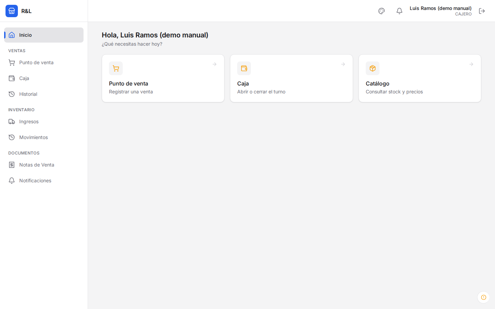

**Menú del ADMIN** — 16 secciones, agrupadas en Ventas, Inventario, Documentos y
Seguridad:

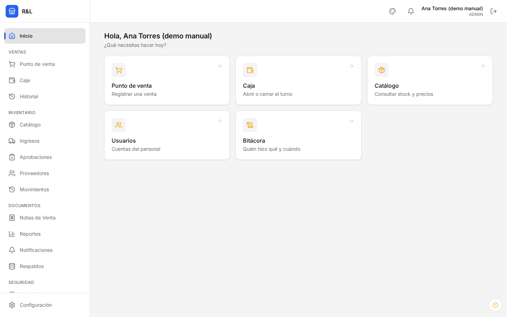

### Si intentas entrar donde no te corresponde

El sistema no te deja, pero **no muestra ningún mensaje de error**: simplemente te
devuelve a la pantalla de Inicio.

Si eres CAJERO y escribes a mano la dirección del Catálogo, de Usuarios, de
Reportes o de Aprobaciones, terminarás aquí:

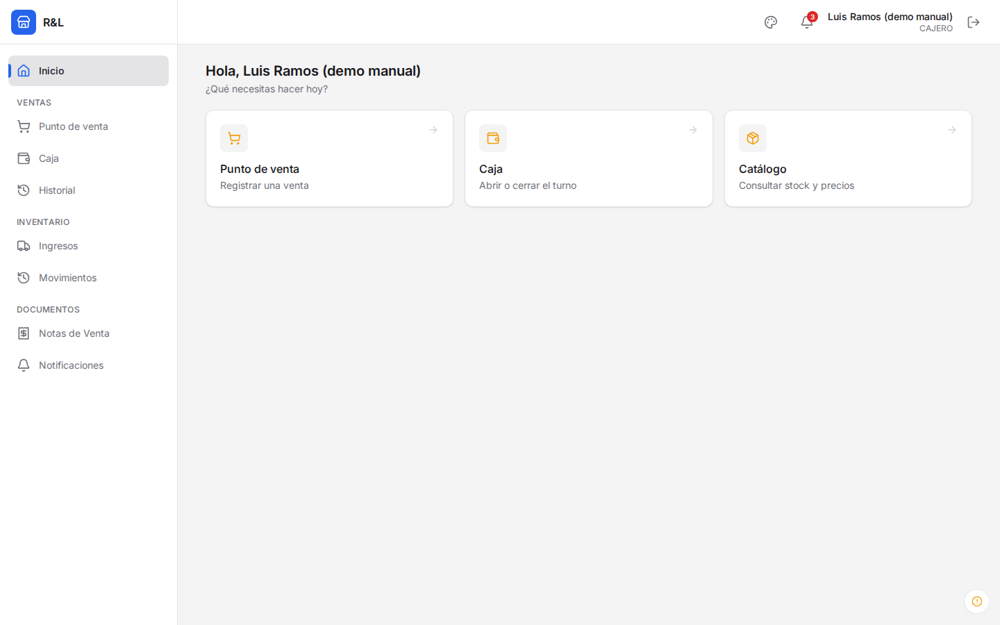

Esto es intencional y no significa que algo esté roto ni que hayas hecho algo mal.
Si necesitas acceso a una sección, pídeselo al administrador.

---

## 3. Iniciar sesión

Abre el navegador (Chrome, Edge, Firefox o Safari) y escribe la dirección que te
dio tu administrador. Verás esta pantalla:

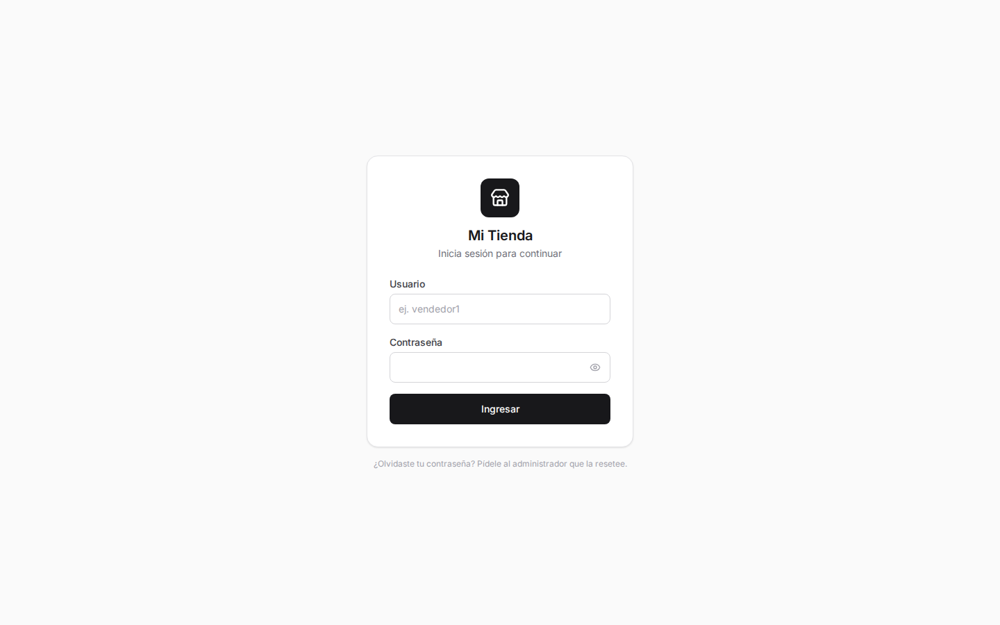

**Pasos:**

1. Escribe tu **usuario**, todo en minúsculas y sin espacios.
2. Escribe tu **contraseña**. Si quieres verla, haz clic en el ojito del campo.
3. Haz clic en **Ingresar**.

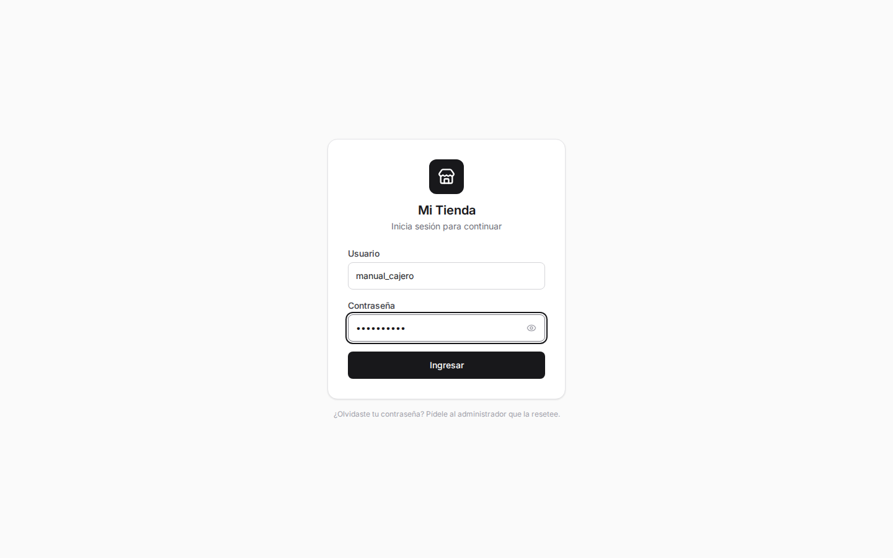

⚠️ **Si es tu primera vez**, el sistema te pedirá cambiar la contraseña antes de
dejarte continuar. Elige una que recuerdes.

⚠️ **Si te equivocas**, aparece este mensaje. Dice "Usuario o contraseña
incorrectos" sin precisar cuál de los dos falló: es a propósito, para que nadie
pueda averiguar qué usuarios existen.

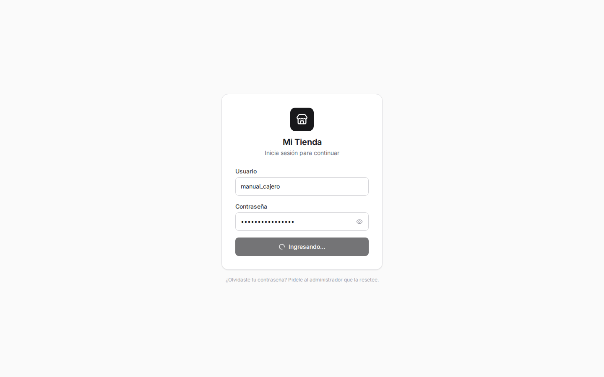

⚠️ **A los 3 intentos fallidos la cuenta se bloquea 15 minutos.** Espera ese
tiempo o pide al administrador que te resetee la contraseña.

💡 La sesión dura varios días. Si cierras el navegador y vuelves más tarde, es
probable que no tengas que iniciar sesión de nuevo.

---

## 4. La pantalla principal

Al entrar verás tres zonas.

**El menú lateral (izquierda).** Las secciones agrupadas por tema. Haz clic en
cualquiera para abrirla; la sección activa queda resaltada.

**La barra superior (derecha).** Tiene tres cosas:

- Una **paleta** para cambiar el estilo visual de la interfaz.
- Una **campana** con un número rojo: tus notificaciones sin leer.
- Tu **nombre y rol**, y a la derecha el botón para **cerrar sesión**.

**El área central.** La pantalla de Inicio muestra tarjetas de acceso directo a lo
que más se usa. Haz clic en una tarjeta para ir a esa sección.

---

## 5. Tareas del CAJERO

### 5.1 Abrir la caja

**Para qué sirve:** antes de vender tienes que declarar con cuánto efectivo
empiezas el turno. Sin caja abierta el Punto de venta no te deja cobrar.

**Pasos:**

1. Haz clic en **Caja** en el menú lateral. Verás que no hay turno abierto:

   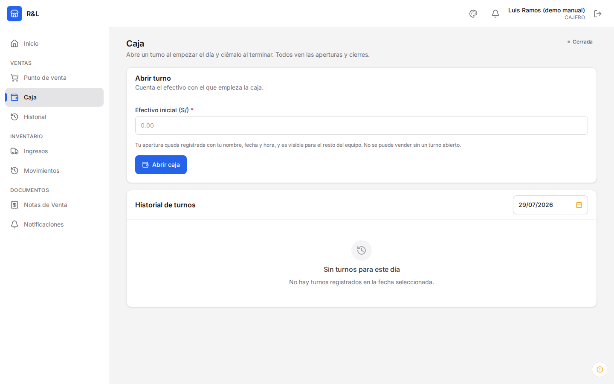

2. Escribe en el campo el efectivo con el que empiezas. En el ejemplo, `100`:

   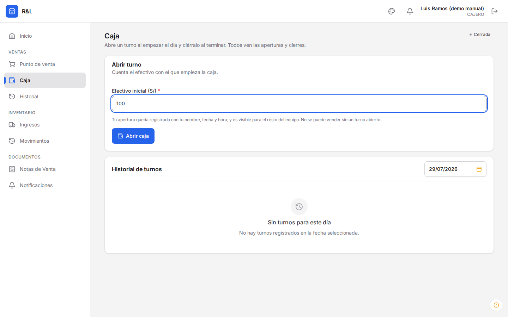

3. Haz clic en **Abrir caja**.

✅ Listo. La pantalla cambia y ya puedes vender:

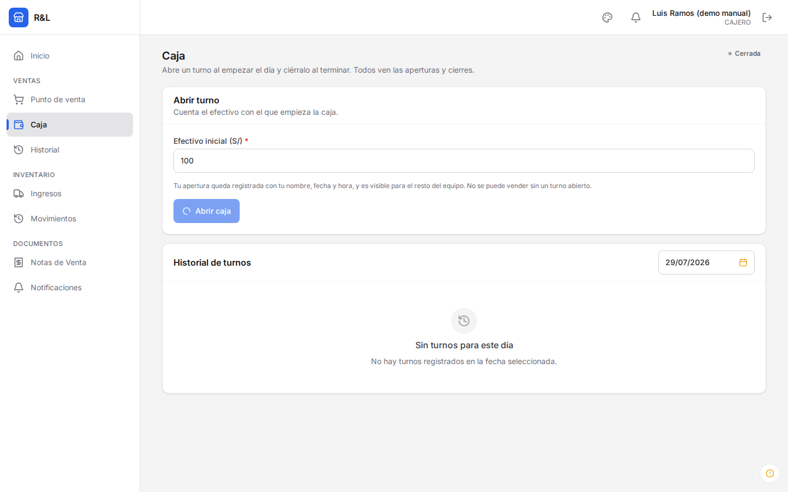

⚠️ **Solo puede haber un turno abierto en todo el sistema a la vez.** Si otro
cajero ya abrió el suyo, tendrás que esperar a que lo cierre.

---

### 5.2 Vender en el Punto de venta

**Para qué sirve:** registrar las ventas del día.

Haz clic en **Punto de venta**. A la izquierda está el buscador y la lista de
productos; a la derecha, el panel **Venta actual** (el carrito). Arriba a la
derecha hay dos indicadores: **En línea** y **Caja abierta**.

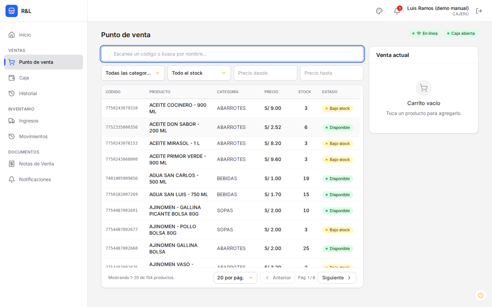

#### Paso 1 — Buscar el producto

Tienes tres formas:

- **Escanear:** deja el cursor en el campo de arriba y dispara el lector. El
  producto se agrega solo.
- **Escribir el nombre:** escribe las primeras letras y la lista se filtra.
- **Filtrar la lista:** por categoría, por estado de stock o por rango de precio.

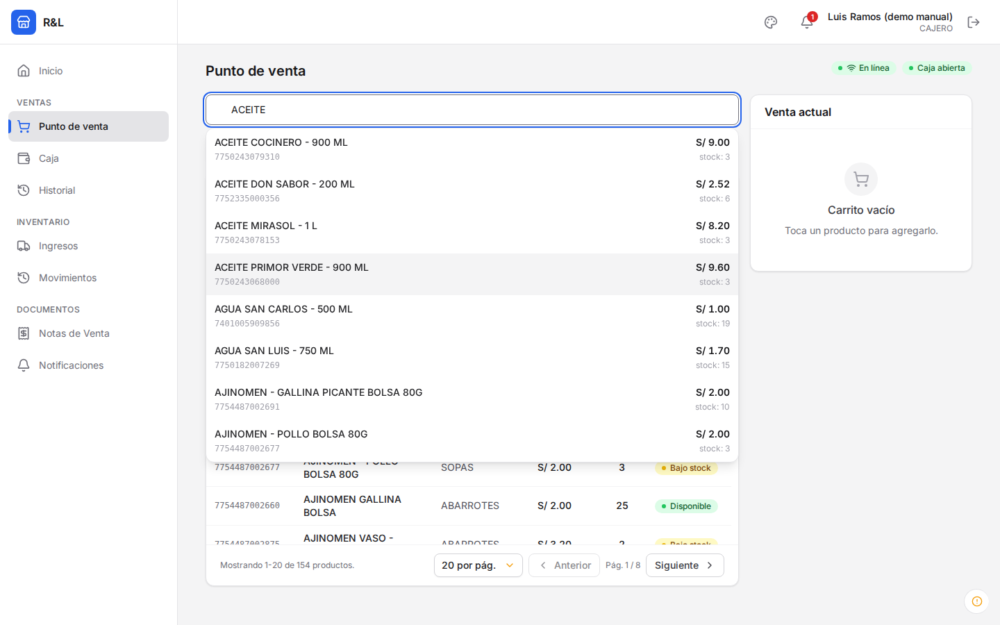

#### Paso 2 — Agregar al carrito

Haz clic en la fila del producto. Aparece en **Venta actual**, a la derecha:

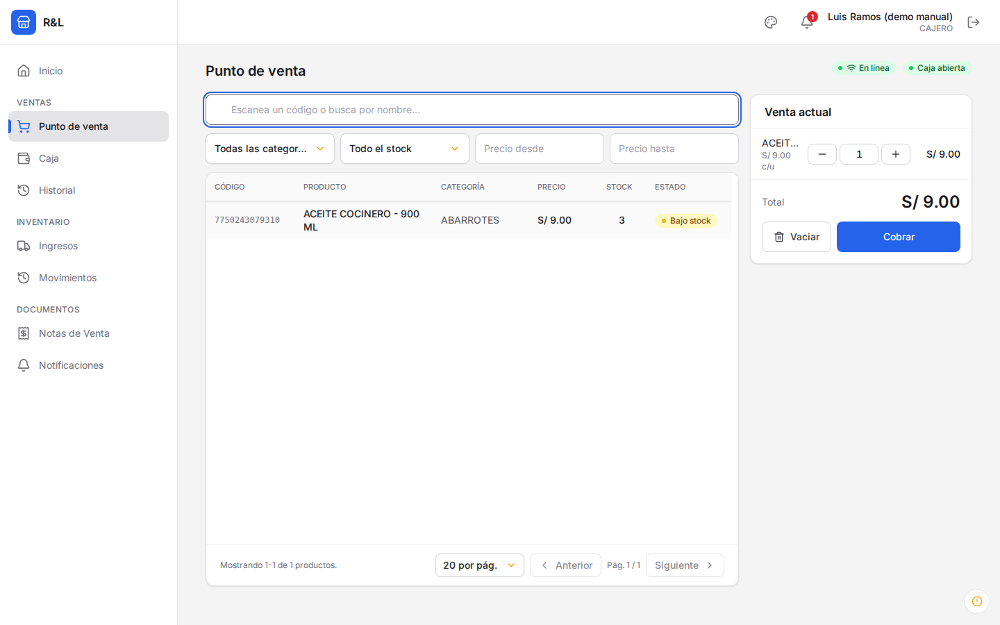

Repite para cada producto. El **Total** se recalcula solo:

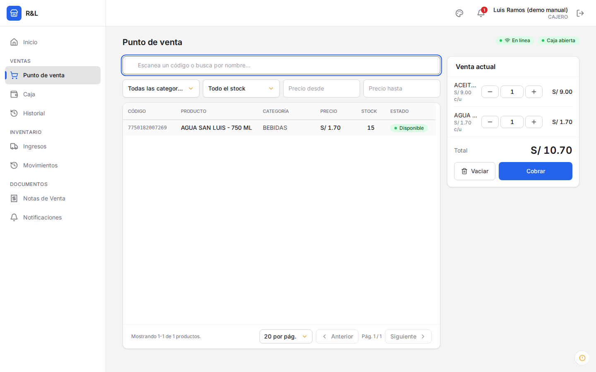

Para cambiar cantidades usa los botones **−** y **+** de cada línea. Para empezar
de cero, **Vaciar**.

#### Paso 3 — Cobrar

1. Haz clic en **Cobrar**. Se abre la ventana con el total arriba.
2. Elige **Un solo método** o **Pago mixto** (si paga con dos medios).
3. Elige el método: **Efectivo**, **Yape**, **Plin**, **Tarjeta** o
   **Transferencia**.
4. Si paga en efectivo, escribe en **¿Con cuánto paga?** el billete que te dio y
   el sistema calcula el vuelto. Ese campo es opcional.
5. Haz clic en **Confirmar venta**.

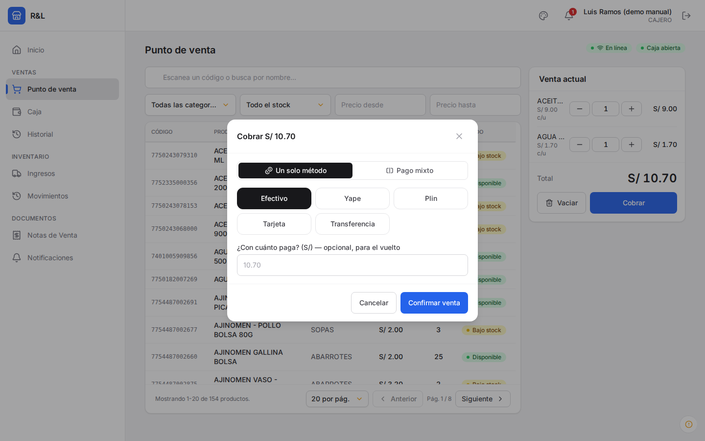

✅ Venta registrada. El carrito se vacía y la venta ya aparece en el Historial:

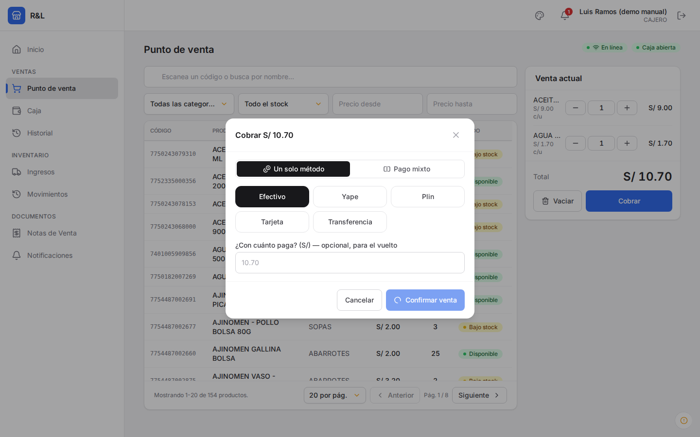

💡 **Pago mixto:** elige esa pestaña, indica el monto de cada método y la suma
debe dar exactamente el total.

#### Si se corta el internet

El indicador de arriba a la derecha cambia y avisa que estás sin conexión. Sigue
vendiendo normalmente: las ventas se guardan en el equipo y se sincronizan solas
cuando vuelve el internet.

⚠️ Si una venta no pudo sincronizarse (por ejemplo, porque otra caja agotó el
stock), el sistema te avisa. Consulta al administrador.

---

### 5.3 Cerrar la caja (arqueo)

**Para qué sirve:** al terminar el turno cuentas el efectivo físico y el sistema
compara contra lo que debería haber.

**Pasos:**

1. Entra a **Caja** y haz clic en **Ir al cierre de caja**.

2. A la izquierda el sistema muestra el cálculo: cuánto había al abrir, cuánto
   entró en ventas en efectivo y **cuánto debe haber en el cajón**. Aparte separa
   lo cobrado por medios digitales, que es plata vendida pero que **no está
   físicamente en la caja**.

   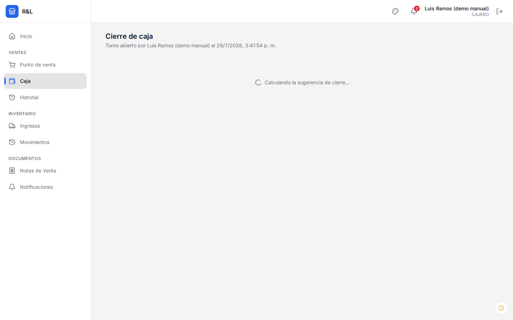

3. Cuenta el dinero del cajón y escribe el total en **Efectivo contado (S/)**.

4. Si el monto **coincide** con lo esperado, haz clic en **Cerrar caja**:

   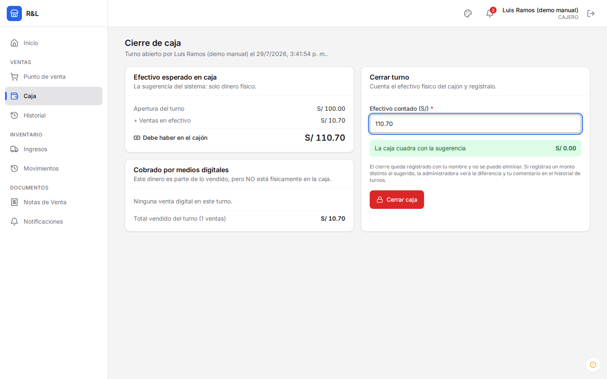

5. Si **no coincide**, el sistema calcula la diferencia y **exige un comentario**
   explicando el motivo. No te deja cerrar sin él:

   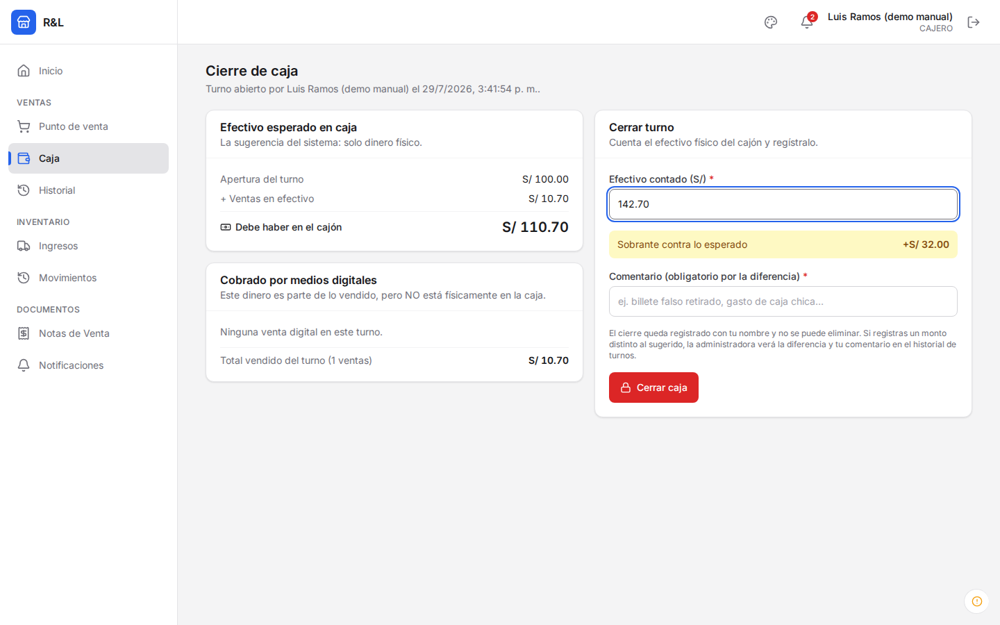

✅ Caja cerrada. El turno queda registrado con tu nombre y **no se puede
eliminar**. Si hubo diferencia, el administrador verá el monto y tu comentario en
el historial de turnos.

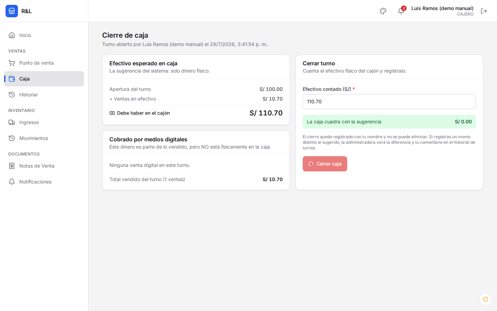

---

### 5.4 Registrar mercadería que llegó

**Para qué sirve:** transcribir la boleta del proveedor cuando llega mercadería.

**Importante:** registrar un ingreso **no suma stock todavía**. El stock sube
recién cuando el ADMIN lo aprueba. Es un control a propósito.

**Pasos:**

1. Haz clic en **Ingresos**. Verás los ingresos ya registrados y su estado:

   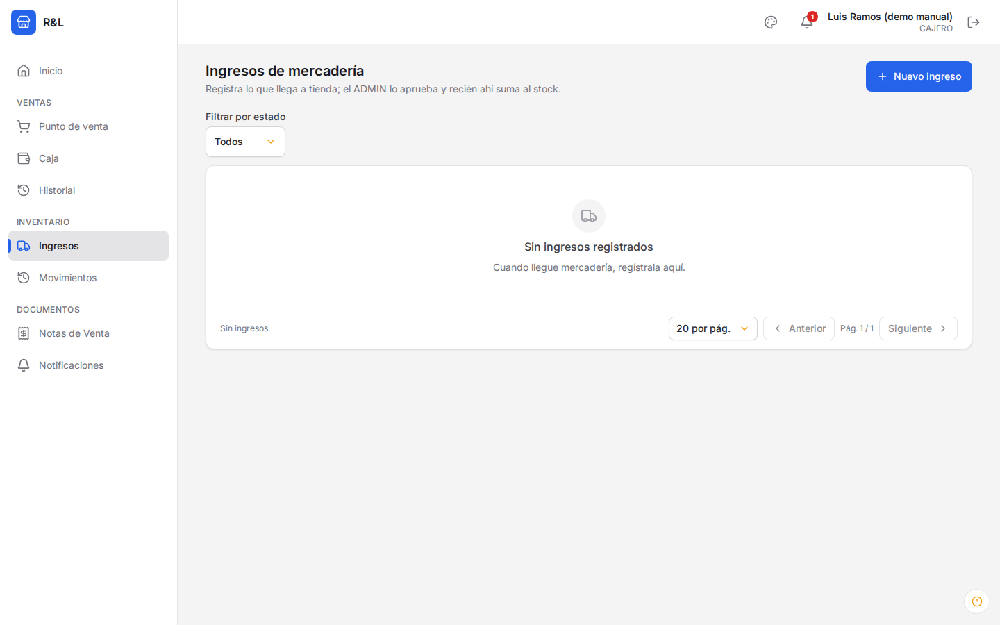

2. Haz clic en **Nuevo ingreso**. Se abre el formulario:

   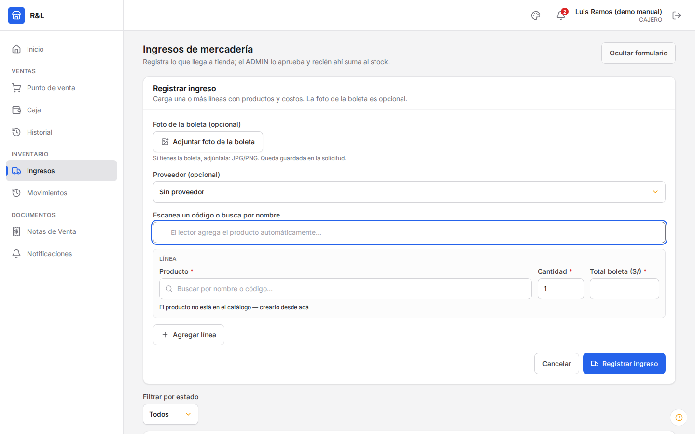

3. **Foto de la boleta (opcional).** Si tienes la boleta, adjúntala en JPG o PNG.
   Si la compra vino sin boleta, puedes continuar sin foto.

4. **Proveedor (opcional).** Elígelo de la lista. Si no corresponde a ninguno,
   déjalo en **Sin proveedor**.

5. **Agrega las líneas.** Escanea el código o busca el producto por nombre:

   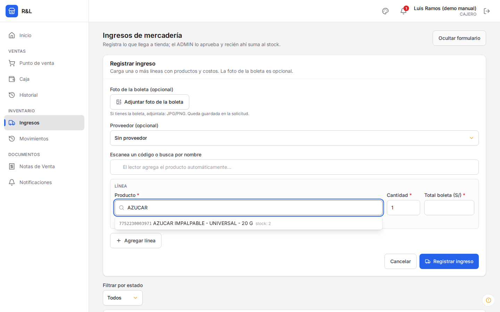

6. Llena **Cantidad** y **Total boleta (S/)**.

   ⚠️ **Ojo con este campo: es el TOTAL de la línea, no el precio por unidad.**
   Si la boleta dice "7 esponjas — S/ 20", escribes `7` y `20`. No dividas nada:
   el sistema calcula el costo unitario y lo muestra debajo del campo.

7. Usa **Agregar línea** para cada producto más de la boleta.

8. Envía la solicitud con el botón del final del formulario.

✅ La solicitud queda **Pendiente** y le llega un aviso al administrador.

---

### 5.5 Registrar un producto que no está en el catálogo

Si llegó mercadería que nunca habías vendido, **no necesitas pedirle al
administrador que la cree primero**. Puedes cargarla desde el mismo formulario de
ingreso.

**Pasos:**

1. En la línea del ingreso, haz clic en
   **"El producto no está en el catálogo — crearlo aquí"**. La línea cambia y
   queda marcada como **LÍNEA · PRODUCTO NUEVO**.

   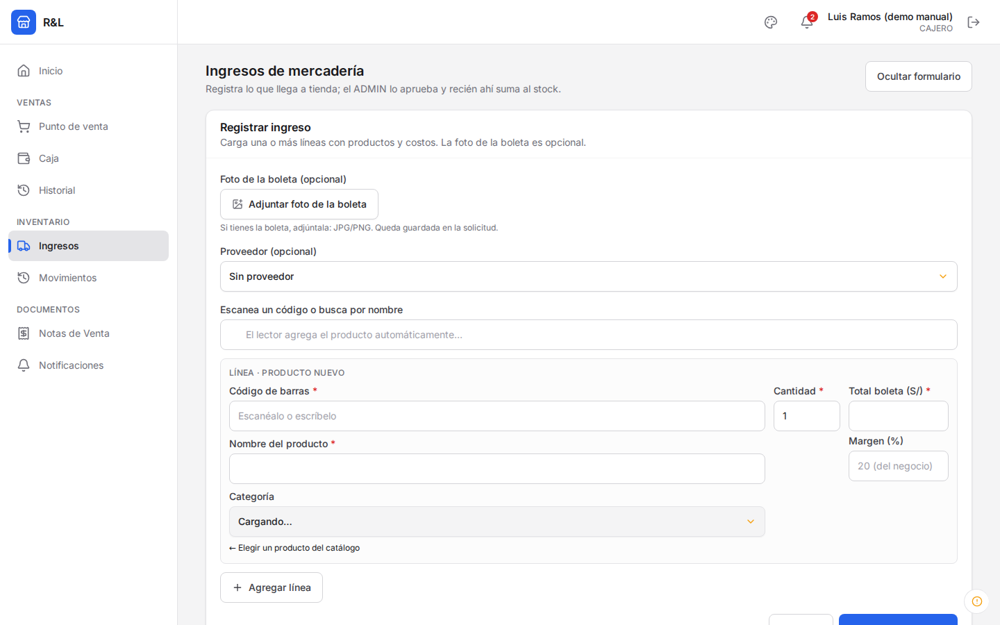

2. Llena **Código de barras** (puedes escanearlo), **Nombre del producto** y
   **Categoría** (opcional).

   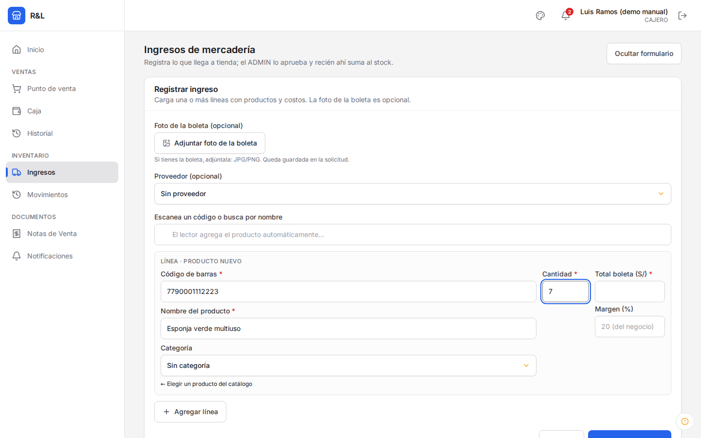

3. Llena **Cantidad** y **Total boleta (S/)** como en cualquier línea.

4. El sistema te muestra **con qué precio va a quedar el producto a la venta**,
   calculado con el margen de ganancia del negocio. En el ejemplo: 7 esponjas por
   S/ 20 dan S/ 2.86 de costo por unidad y, con 20% de ganancia, se venderá a
   **S/ 3.50**.

   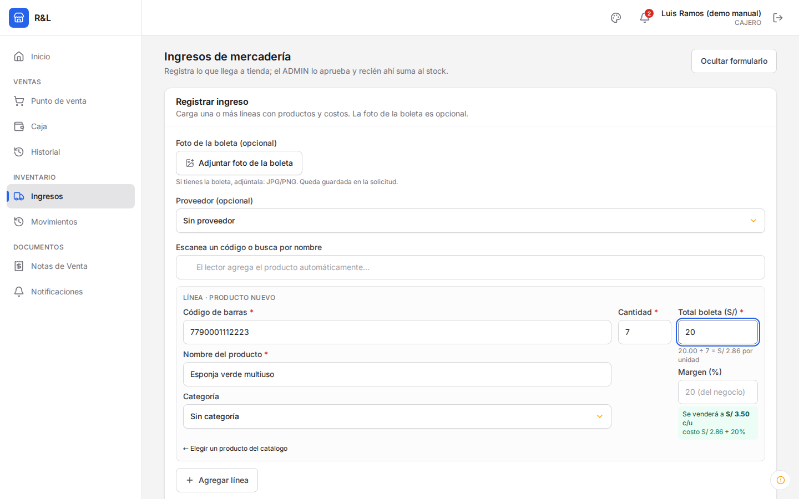

5. Si ese precio no te sirve, cambia el **Margen (%)** de esa línea y el precio se
   recalcula al instante.

✅ El producto **se crea en el catálogo recién cuando el ADMIN aprueba** el
ingreso. Hasta entonces la línea aparece marcada como producto nuevo.

💡 Puedes mezclar en la misma solicitud líneas de productos del catálogo y líneas
de productos nuevos.

💡 Si el código de barras que escribes ya existe en el catálogo, el sistema te
avisa para que elijas ese producto en vez de crear un duplicado.

---

### 5.6 Historial de ventas, anular y devolver

**Para qué sirve:** ver las ventas hechas, anular una venta o devolver productos.

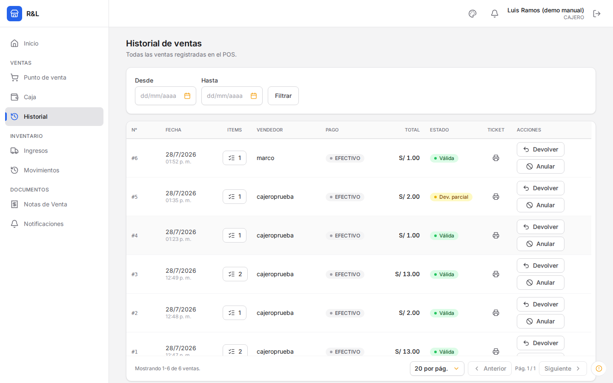

**Para consultar:**

1. Haz clic en **Historial**.
2. Filtra por rango de fechas si buscas algo puntual.
3. Haz clic en una venta para ver su detalle: productos, cantidades y cómo se
   pagó.

**Para anular una venta completa** (el cliente devuelve todo): abre la venta,
elige anular y escribe el motivo (obligatorio). El sistema repone el stock y
descuenta el efectivo del turno actual.

**Para una devolución parcial** (el cliente devuelve solo algunos productos): abre
la venta, indica cuántas unidades de cada producto vuelven y el motivo. Solo se
repone lo devuelto y el monto se ajusta en proporción.

**Para reimprimir un ticket:** abre la venta y usa la opción de imprimir.

⚠️ **Ni la anulación ni la devolución borran la venta.** Queda registrada como
anulada, con tu nombre y el motivo. El histórico contable no se puede borrar.

---

### 5.7 Movimientos, Notas de venta y Notificaciones

**Movimientos** es el registro de toda variación de stock: qué entró, qué salió,
por qué y quién lo hizo. Solo se consulta, no se edita.

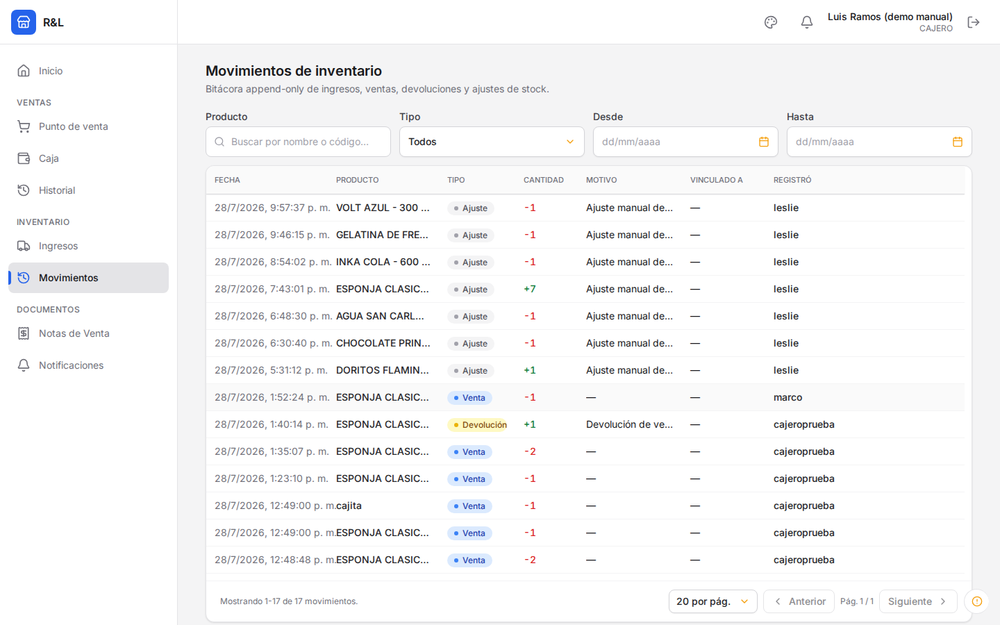

**Notas de Venta** son las boletas digitales de cada venta. Puedes consultarlas y
descargarlas.

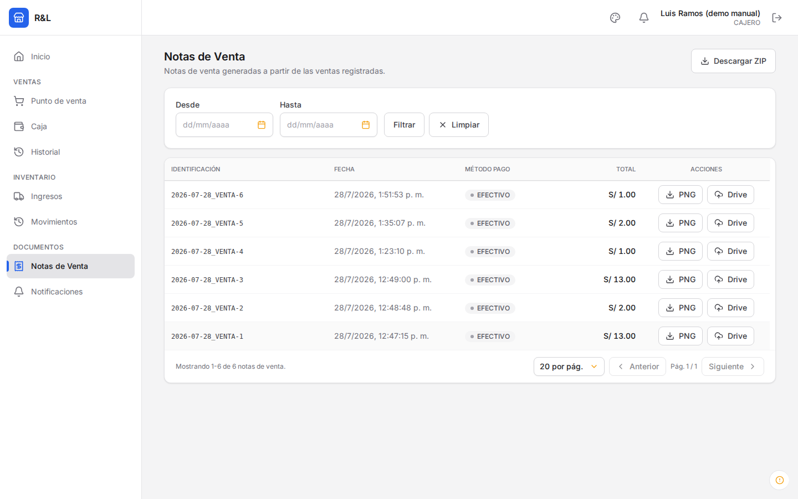

**Notificaciones** son los avisos del sistema: stock bajo, apertura y cierre de
caja, y solicitudes de ingreso. El número rojo de la campana son las no leídas.

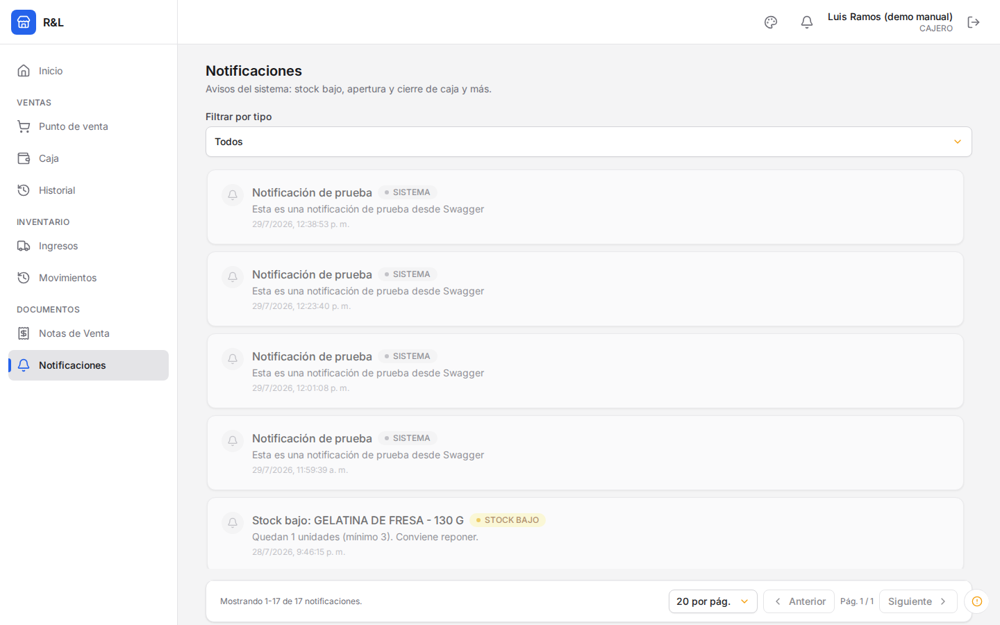

---

## 6. Tareas del ADMIN

El ADMIN puede hacer **todo lo del CAJERO** (vender, abrir y cerrar caja,
registrar ingresos) más las secciones de esta parte.

### 6.1 Catálogo de productos

**Para qué sirve:** administrar qué vendes, a qué precio y cuánto tienes.

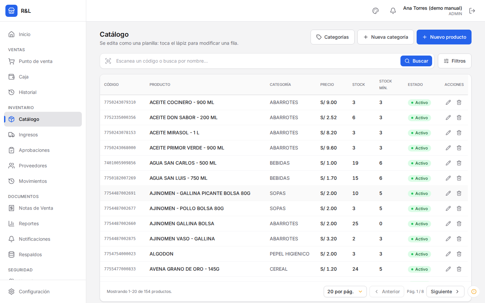

#### Crear un producto

1. Haz clic en **Nuevo producto**.
2. Llena el formulario: código de barras, nombre, categoría, precio de venta,
   precio de compra, stock inicial y stock mínimo.
3. Guarda.

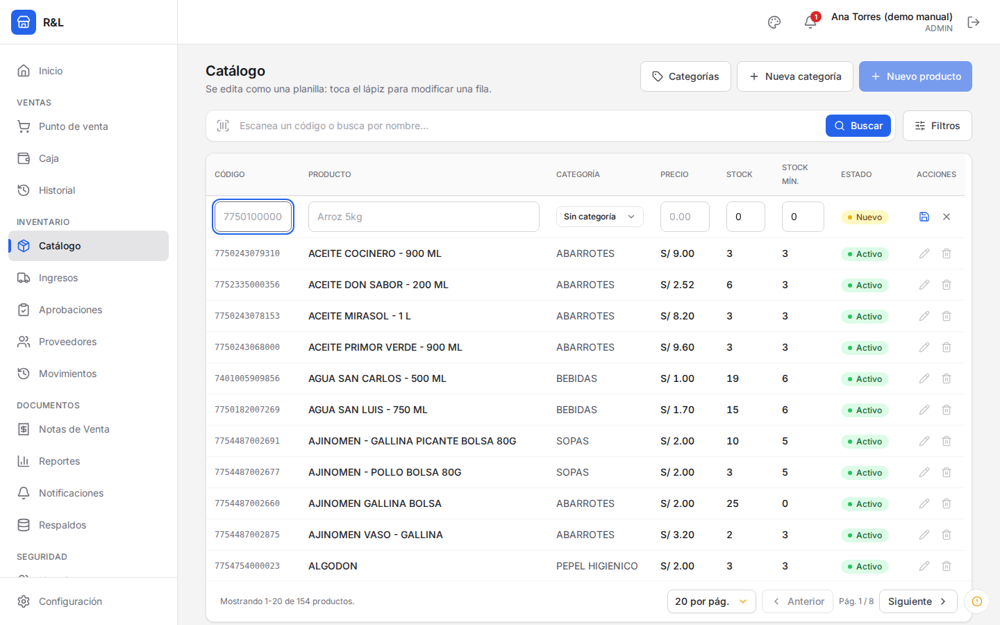

💡 El **stock mínimo** es el nivel en el que quieres que el sistema te avise. Al
llegar a él recibes una notificación de stock bajo. La alerta se emite una sola
vez y se rearma cuando el stock vuelve a superar el mínimo.

#### Editar un producto o cambiar su precio

Haz clic en el ícono de lápiz de la fila. Se abre el mismo formulario con los
datos cargados.

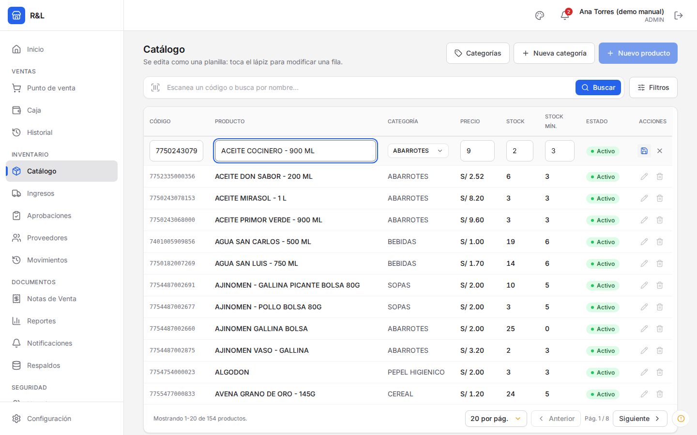

💡 Cada cambio de precio queda en un **historial de precios** que no se puede
editar ni borrar.

#### Buscar y filtrar

Escanea o escribe en el buscador y pulsa **Buscar**. Para búsquedas más finas usa
**Filtros**: categoría, estado del stock y rango de precios.

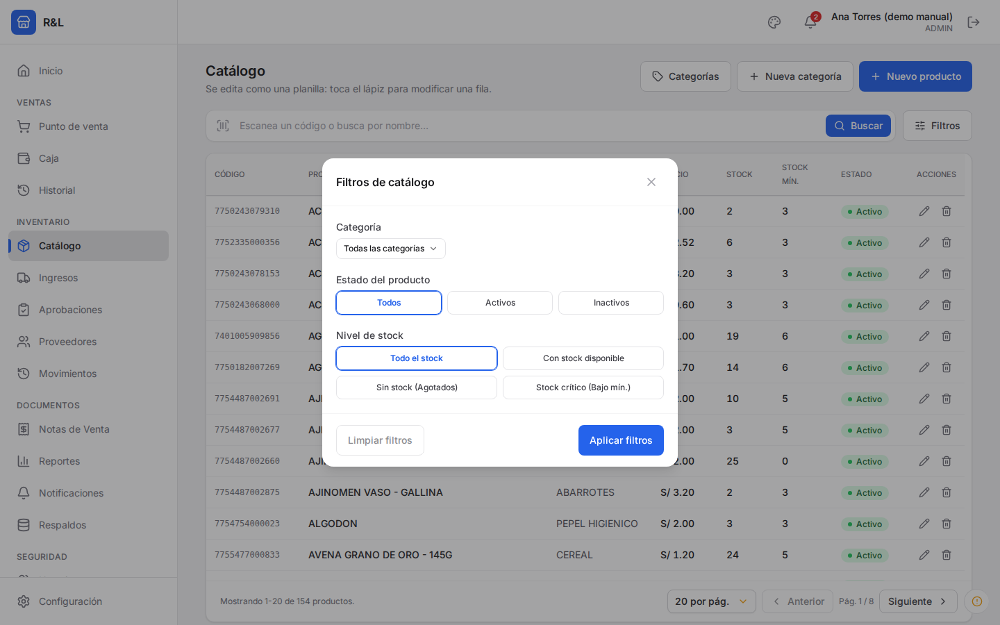

#### Eliminar un producto

Haz clic en el ícono de tacho. El producto **no se borra de verdad**: se da de
baja y desaparece de los listados, pero su histórico de ventas se conserva. Su
código de barras queda libre para reutilizarlo en otro producto.

---

### 6.2 Categorías

Sirven para agrupar productos y filtrar más rápido.

1. En el Catálogo, haz clic en **Categorías** para ver y editar las existentes.
2. Haz clic en **Nueva categoría** para crear una.

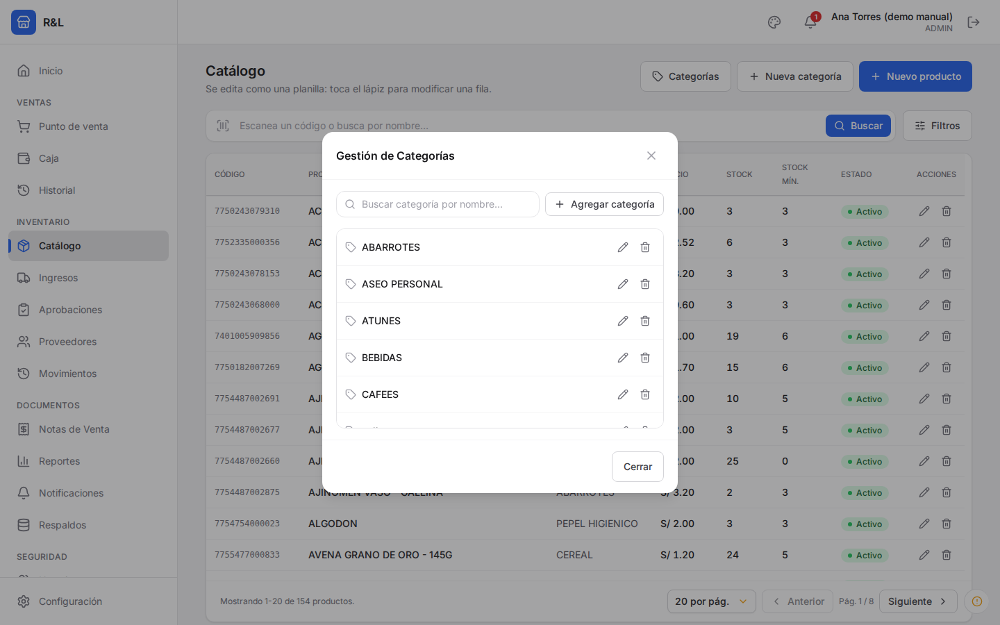

⚠️ No puedes crear dos categorías con el mismo nombre.

---

### 6.3 Aprobar ingresos de mercadería

**Para qué sirve:** revisar lo que registró el cajero y, si está correcto,
sumarlo al stock. **Hasta que apruebes, el stock no cambia.**

**Pasos:**

1. Haz clic en **Aprobaciones**. Verás las solicitudes y su estado:

   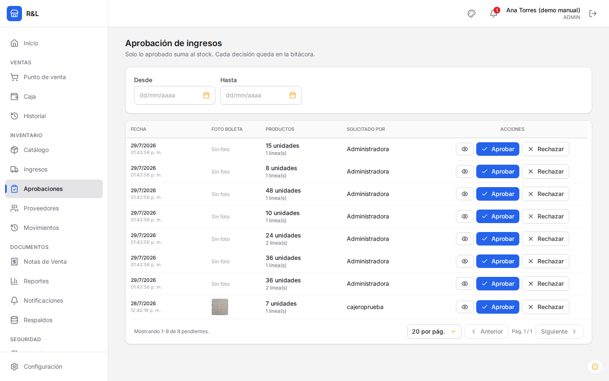

2. Haz clic en **Ver detalle** para revisar línea por línea contra la foto de la
   boleta:

   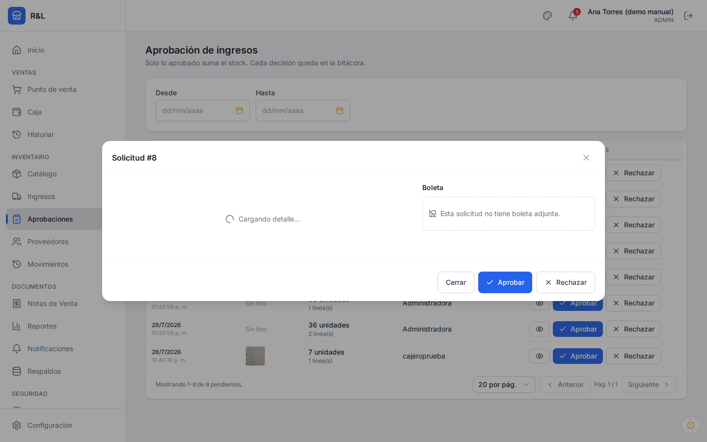

3. Si algo está mal, puedes **editar** las líneas antes de aprobar: cantidades,
   totales, el proveedor y, en los productos nuevos, el margen de ganancia.

4. Haz clic en **Aprobar** o en **Rechazar**. Si rechazas, el motivo es
   obligatorio (mínimo 5 caracteres).

**Al aprobar, el sistema hace cuatro cosas en una sola operación:**

- Suma las cantidades al stock de cada producto.
- Deja un movimiento de inventario por cada línea.
- Actualiza el precio de compra de cada producto y lo guarda en el historial.
- **Crea los productos nuevos** que propuso el cajero, con el precio de venta
  calculado según el margen.

💡 Si la solicitud incluye productos nuevos, el aviso lo indica **antes** de que
apruebes, porque aprobar implica además darlos de alta en el catálogo.

💡 Al aprobar puedes marcar la compra como **a crédito**: la deuda del proveedor
se actualiza en la misma operación.

⚠️ Si mientras la solicitud esperaba alguien creó un producto con el mismo código
de barras, el sistema no lo duplica: te avisa para que edites la línea y la
apuntes al producto que ya existe.

---

### 6.4 Proveedores

**Para qué sirve:** llevar a quién le compras y cuánto le debes.

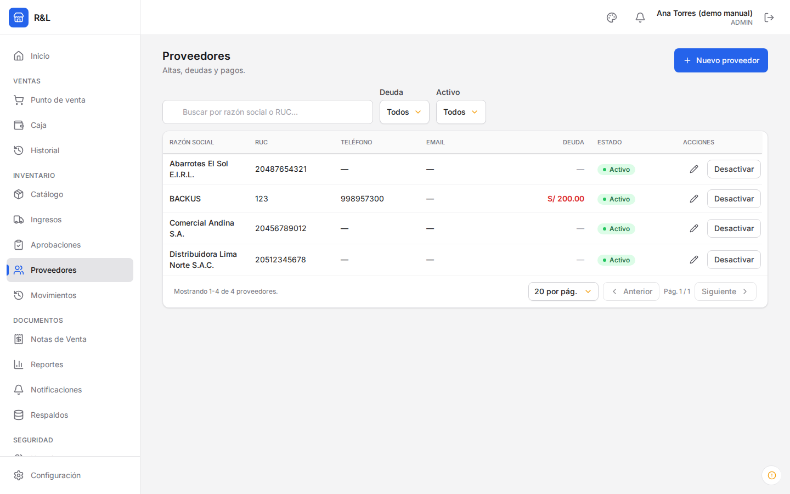

1. Haz clic en **Nuevo proveedor**.
2. Llena razón social, RUC, teléfono, correo y dirección.
3. Guarda.

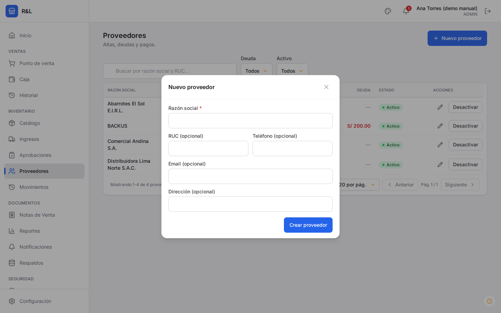

Desde la ficha de cada proveedor puedes registrar **compras a crédito** y
**pagos**, y ver la deuda acumulada.

⚠️ Un pago no puede superar la deuda actual.

---

### 6.5 Reportes

**Para qué sirve:** saber cuánto vendiste, cuánto gastaste y en qué.

**Pasos:**

1. Haz clic en **Reportes**. Al entrar está vacío, esperando que elijas fechas:

   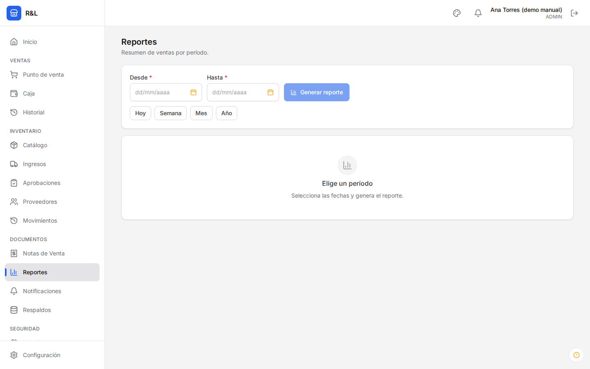

2. Elige el período: escribe las fechas en **Desde** y **Hasta**, o usa los
   atajos **Hoy**, **Semana**, **Mes** o **Año**.

3. Haz clic en **Generar reporte**. Puede tardar unos segundos.

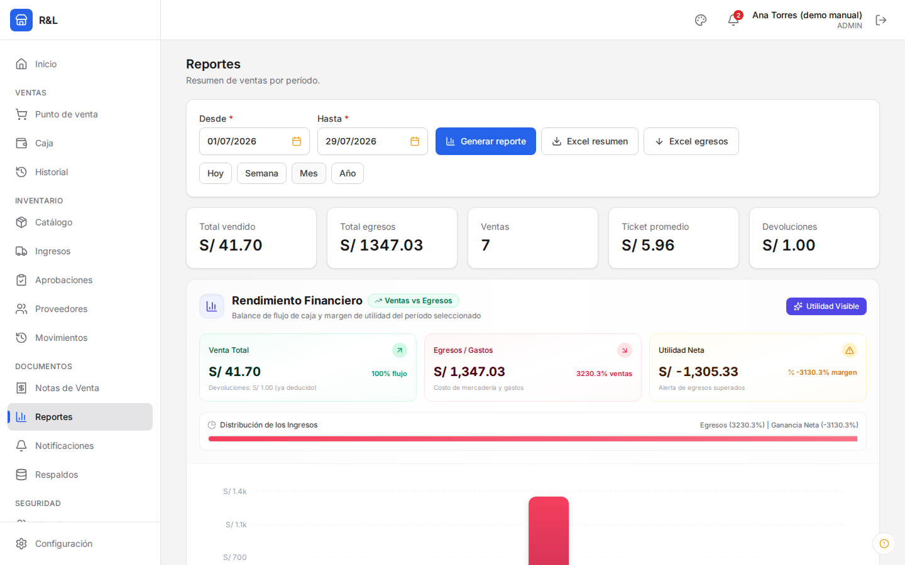

Así se ve el reporte completo, de arriba a abajo:

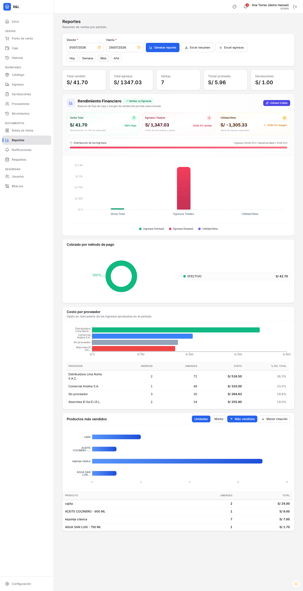

El reporte incluye:

- **Total vendido**, **total de egresos** y **utilidad neta** del período.
- **Número de ventas** y **ticket promedio**.
- Un gráfico de **Ingresos vs. Egresos vs. Utilidad**.
- **Cobrado por método de pago**, en gráfico de anillo.
- **Costo por proveedor** (ver abajo).
- **Productos más vendidos**, que puedes ordenar por unidades o por monto, y
  darle vuelta para ver los de **menor rotación**.

#### Costo por proveedor

Muestra en qué proveedor se te fue el dinero de mercadería. Sale de los ingresos
**aprobados** del período, así que el total coincide con los egresos.

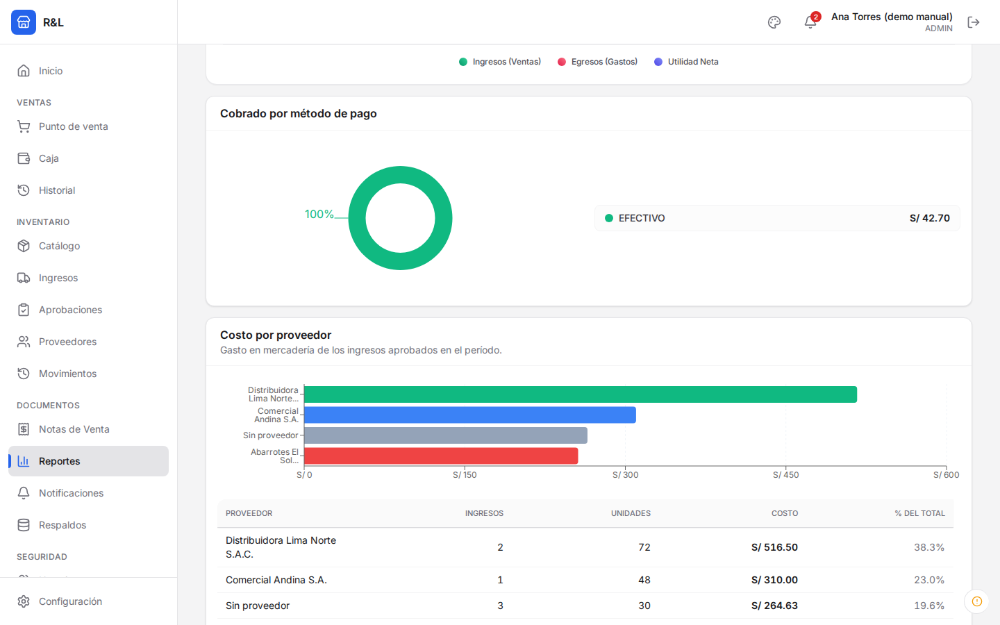

La tabla trae, por proveedor: cuántos ingresos, cuántas unidades, el costo y el
**% del total**.

💡 Las compras registradas **sin proveedor asignado** aparecen agrupadas como
**"Sin proveedor"**, en gris en el gráfico. No se ocultan a propósito: si se
omitieran, la suma no cuadraría con el total de egresos y no habría forma de
notar el faltante.

#### Exportar a Excel

Con el reporte en pantalla, usa los botones de descarga. El Excel trae el
resumen, el cobrado por método de pago, la tabla de **costo por proveedor** y los
productos más vendidos, ya formateado.

---

### 6.6 Usuarios

**Para qué sirve:** dar de alta al personal y controlar qué puede hacer cada uno.

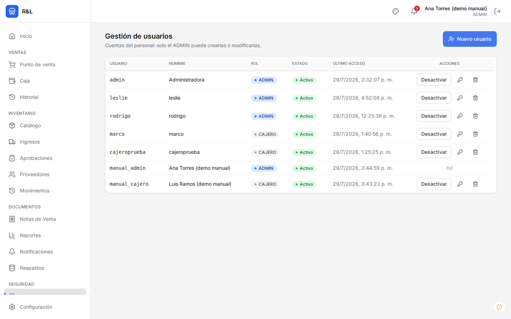

#### Crear un usuario

1. Haz clic en **Nuevo usuario**.
2. Llena nombre completo, usuario (en minúsculas, sin espacios) y una contraseña
   temporal.
3. Elige el rol: **ADMIN** o **CAJERO**.
4. Guarda.

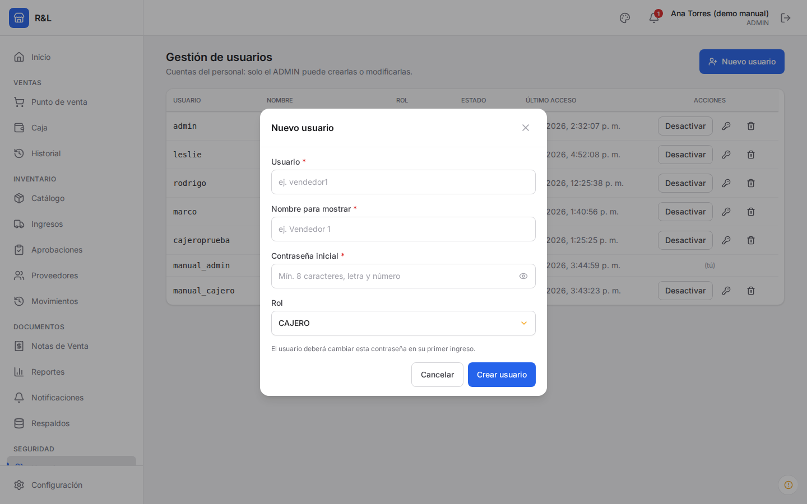

💡 En su primer ingreso el sistema le va a exigir cambiar la contraseña, así que
no necesitas conocer su clave definitiva.

#### Resetear una contraseña

Si alguien la olvidó o quedó bloqueado, haz clic en **Resetear contraseña** en su
fila. Se le asigna una temporal y **se cierran todas sus sesiones abiertas**.

#### Desactivar o eliminar

**Desactivar** impide que entre pero conserva todo su histórico; es lo recomendado
cuando alguien deja de trabajar. **Eliminar** es una baja lógica: el usuario
desaparece de los listados pero su rastro en ventas y bitácora se mantiene.

⚠️ No puedes desactivar tu propia cuenta.

---

### 6.7 Bitácora de auditoría

**Para qué sirve:** ver quién hizo qué y cuándo. Registra ingresos y salidas del
sistema, cambios de precio, ajustes de stock, aprobaciones, anulaciones y
modificaciones de usuarios.

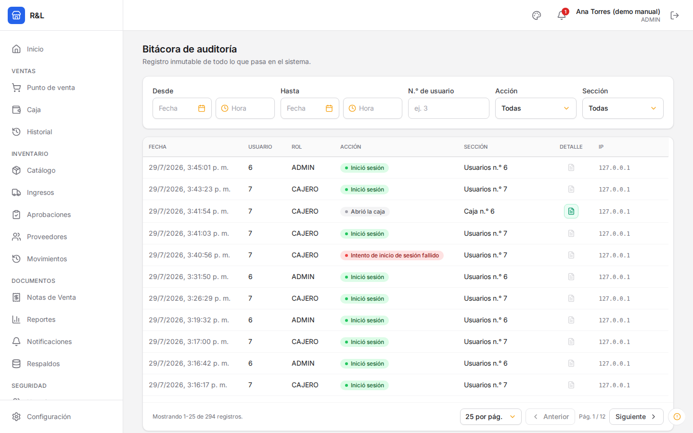

Puedes filtrar por fecha, por tipo de acción y por usuario.

⚠️ La bitácora **solo acepta registros nuevos**: nadie puede editarla ni borrar un
evento, tampoco un ADMIN.

---

### 6.8 Respaldos

**Para qué sirve:** guardar una copia de seguridad de toda la información.

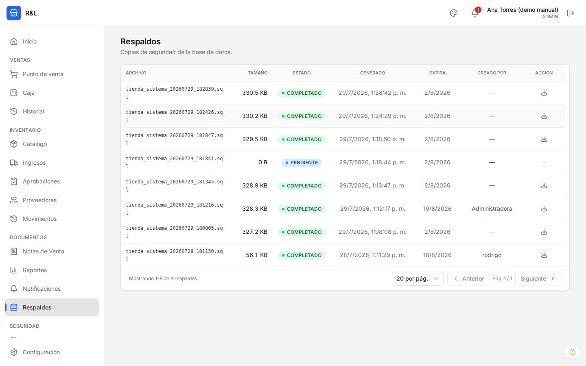

El sistema genera respaldos automáticamente y los sube a Google Drive. Desde esta
pantalla ves los disponibles y puedes **descargar** el que necesites.

💡 Los respaldos tienen fecha de expiración. Si hay uno que quieres conservar,
descárgalo a tu computadora.

---

### 6.9 Configuración del negocio

**Para qué sirve:** ajustar la identidad y las reglas del sistema sin tocar
código.

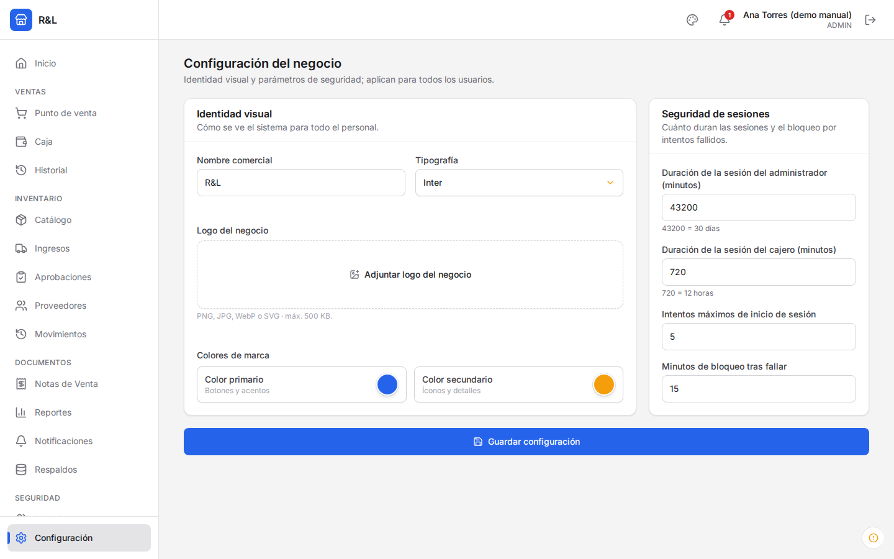

Desde aquí controlas:

- **Nombre del negocio** y **logo**, que aparecen en el login y en las boletas.
- **Colores** y **tipografía** de la interfaz.
- **Duración de la sesión** para ADMIN y para CAJERO, por separado.
- **Intentos de login permitidos** y **minutos de bloqueo** tras fallarlos.
- **Margen de ganancia por defecto**: el porcentaje con el que se calcula el
  precio de venta de un producto nuevo dado de alta desde un ingreso.

Haz clic en **Guardar configuración** al terminar.

💡 El margen por defecto se puede pisar línea por línea al aprobar un ingreso, así
que ponlo en el valor que uses la mayoría de las veces.

💡 Los cambios de logo y colores se ven al instante, sin recargar la página.

---

## 7. Consejos

💡 **Lector de barras.** Deja el cursor en el campo de búsqueda y dispara. No
necesitas hacer clic antes de cada producto.

💡 **Búsqueda rápida.** Escribe solo las primeras 3 letras del nombre.

💡 **Bitácora.** Usa los filtros de fecha para no perderte entre miles de
registros.

💡 **Notas de venta.** Si necesitas varias, usa la descarga en ZIP en vez de una
por una.

💡 **Sesión compartida.** Cierra sesión al terminar tu turno si la computadora la
usan varias personas.

💡 **Sin conexión.** Si ves el aviso de que no hay internet, sigue vendiendo. El
sistema sincroniza cuando vuelve.

---

## 8. Errores comunes y qué hacer

| Lo que ves | Qué pasó | Qué hacer |
|---|---|---|
| "Usuario o contraseña incorrectos" | Alguno de los dos está mal escrito | Revisa mayúsculas y Bloq Mayús. A los 3 intentos la cuenta se bloquea 15 min |
| "Cuenta bloqueada temporalmente" | 3 intentos fallidos | Espera 15 minutos o pide al ADMIN que resetee tu contraseña |
| "Sesión inválida o expirada" | Tu sesión caducó | Vuelve a iniciar sesión |
| "No hay conexión con el sistema" | El navegador no alcanza al servidor | Revisa tu internet. En el Punto de venta puedes seguir vendiendo sin conexión |
| El Punto de venta no deja cobrar | No hay turno de caja abierto | Ve a **Caja** y abre el turno |
| "Solo puede haber un turno abierto" | Otro cajero tiene el suyo abierto | Espera a que lo cierre |
| No te deja cerrar la caja | El monto contado difiere del esperado | Escribe el comentario explicando la diferencia: es obligatorio |
| "No tienes permiso" al abrir una sección | Tu rol no la incluye | Normal si eres CAJERO. Pídeselo al ADMIN si lo necesitas |
| "No hay ningún producto que coincida" | El código escaneado no está registrado | Verifica el código, o pide al ADMIN que cree el producto |
| "No tiene stock disponible" | El producto se agotó | Registra un ingreso de mercadería y pide que lo aprueben |
| Registraste un ingreso y el stock no subió | Falta la aprobación del ADMIN | Es el comportamiento esperado. Avísale para que lo revise |
| "El código ya pertenece a otro producto" | Ese código de barras ya está en el catálogo | Elige ese producto de la lista en vez de crearlo de nuevo |
| "Ya existe un producto con ese código" | Estás creando un duplicado | Usa otro código o edita el producto existente |
| "El usuario ya existe" | El alias está en uso | Elige otro alias |
| "No puedes desactivar tu propia cuenta" | Te estás desactivando a ti mismo | Pídeselo a otro ADMIN |
| "Motivo requerido (mínimo 5 caracteres)" | Falta explicar un rechazo o una anulación | Escribe al menos 5 caracteres |
| "El pago no puede superar la deuda actual" | Estás pagando más de lo que debes | Escribe un monto igual o menor a la deuda |
| Una venta no se sincronizó | Se vendió offline y el stock ya no alcanzaba | Consulta al ADMIN: hay que revisar el stock real |
| No puedes eliminar un producto | Tiene ventas o movimientos asociados | Usa la baja lógica: se oculta y conserva el histórico |
| "Google Drive no está autorizado" | Falta vincular la cuenta de Google | Ve a **Respaldos** y autoriza Google Drive |

---

## 9. Preguntas frecuentes

**¿Puedo usar el sistema en el celular?**
Sí, desde el navegador. La interfaz se adapta a pantallas chicas. Para vender con
lector de barras es más cómoda una computadora o tablet.

**¿Qué pasa si se corta el internet en plena venta?**
El Punto de venta sigue funcionando. Las ventas se guardan en el equipo y se
sincronizan cuando vuelve la conexión.

**¿Puedo tener dos cajas abiertas al mismo tiempo?**
No. Solo un turno abierto a la vez en todo el sistema.

**¿Cómo sé cuánto dinero debería tener en la caja?**
Al entrar al cierre, el sistema te muestra cuánto debe haber en el cajón. Tú solo
cuentas el dinero real y lo escribes.

**¿Por qué registré un ingreso y el stock sigue igual?**
Porque falta que el ADMIN lo apruebe. Es un control intencional: el stock cambia
recién con la aprobación.

**Llegó un producto que no tengo en el catálogo. ¿Tengo que esperar al ADMIN?**
No. En el formulario de ingreso usa
**"El producto no está en el catálogo — crearlo aquí"**, escribe código, nombre y
categoría, y sigue cargando la boleta. El producto se crea al aprobarse.

**En el ingreso, ¿el precio que pide es por unidad o el total?**
Es el **total de la línea**, tal como figura en la boleta. Si 7 esponjas costaron
S/ 20, escribes 7 y 20. El sistema calcula el costo por unidad.

**¿De dónde sale el precio de venta de un producto nuevo?**
Del margen de ganancia configurado en el negocio (por defecto 20%), aplicado
sobre el costo unitario y redondeado hacia arriba a los 10 céntimos. Se puede
cambiar línea por línea al aprobar.

**¿Puedo borrar una venta equivocada?**
No se borra, se **anula**. Queda registrada como anulada con tu nombre y el
motivo, y el stock se repone.

**¿Puedo devolver solo un producto de una venta?**
Sí. En el Historial, abre la venta y elige la devolución parcial indicando qué
productos y cuántas unidades.

**¿Puedo cambiar la bitácora?**
No. Nadie puede editarla ni borrar eventos, tampoco un ADMIN.

**¿Qué diferencia hay entre desactivar y eliminar un usuario?**
Desactivar le quita el acceso y conserva todo. Eliminar lo saca de los listados
pero mantiene su rastro en ventas y bitácora. Nunca se pierde el histórico.

**¿Cuántas sesiones puedo tener abiertas?**
Las que necesites. Puedes estar en la caja y en el celular a la vez; cerrar sesión
en un dispositivo no afecta a los otros.

**El reporte muestra "Sin proveedor". ¿Es un error?**
No. Son las compras registradas sin asignar proveedor. Se muestran agrupadas para
que el total de costos cuadre con el de egresos.

**¿Qué pasa si un cajero vende un producto sin stock?**
El sistema lo impide: no deja agregar al carrito un producto sin existencias.

**¿Puedo ver quién hizo una venta o cambió un precio?**
Sí. El ADMIN lo ve todo en la Bitácora de auditoría.

**¿Qué hago si olvido mi contraseña?**
Pide al ADMIN que la resetee desde la sección de Usuarios.

---

## 10. A quién contactar

- **Tu administrador (ADMIN).** Puede crear usuarios, resetear contraseñas,
  aprobar ingresos, ver la bitácora y cambiar la configuración.
- **Soporte técnico.** _[Completa aquí el nombre, teléfono o correo del equipo de
  soporte de tu sistema.]_

Si ves un mensaje que no entiendes, toma una captura de pantalla y envíasela a tu
administrador.

---

*Manual de usuario de Project K.I.O.S.K.O. — capturas tomadas del sistema en
funcionamiento.*
